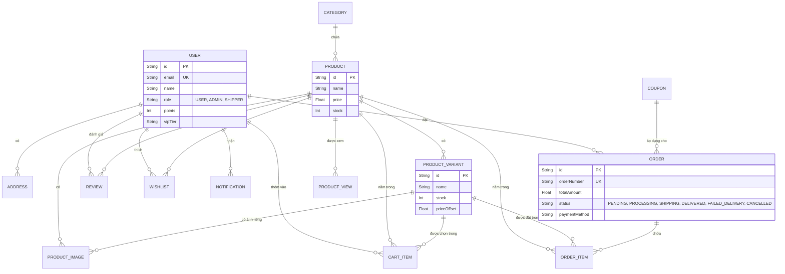
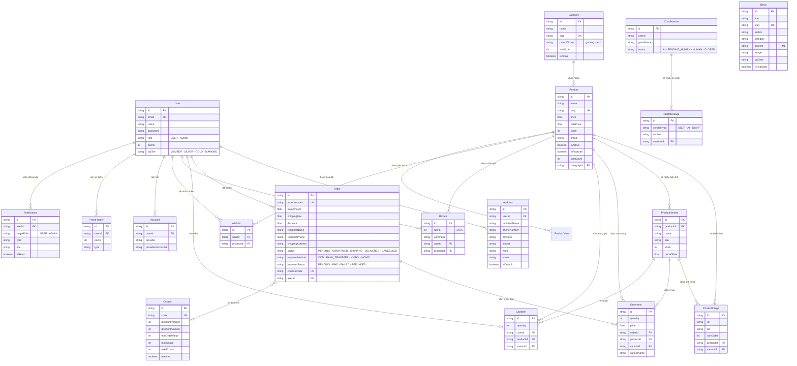

<div align="center">
  
  <h1>🌀 VORTEX — Gaming Gear & Phụ Kiện Công Nghệ</h1>
  <p><i>Trang web thương mại điện tử chuyên nghiệp cấp cao với giao diện Dark Premium</i></p>
</div>

---

## 📖 Giới thiệu
VORTEX là một nền tảng thương mại điện tử hiện đại, chuyên cung cấp các thiết bị Gaming Gear (bàn phím cơ, chuột gaming, tai nghe) và phụ kiện công nghệ cao cấp. Với phong cách thiết kế **Dark Premium**, kết hợp cùng các hiệu ứng viền Neon và cấu trúc giao diện tối ưu, VORTEX mang lại trải nghiệm mua sắm tuyệt vời, mượt mà và trực quan nhất cho cộng đồng game thủ và người yêu công nghệ.

## ✨ Tính năng nổi bật
* **Giao diện & Trải nghiệm (UI/UX):**
  * Thiết kế Dark Mode toàn diện, sang trọng.
  * Hiệu ứng chuyển động mượt mà, Hover đa dạng (vd: Hover Drawer cực mượt bên trang Admin), thân thiện với người dùng.
* **Sản phẩm & Mua sắm:**
  * Bộ lọc sản phẩm chuyên sâu (theo danh mục, thương hiệu, giá cả). Đặc biệt có **Bộ lọc Màu sắc động** tự động gom nhóm và nhận diện màu sắc từ biến thể (variants).
  * Bộ lọc giá thông minh chặn số âm và tự động hoán đổi khi giá trị min > max.
  * Hiển thị trạng thái "Còn hàng" / "Hết hàng" dựa vào kho (inventory), tự động hiển thị biến thể còn hàng nếu sản phẩm gốc hết hàng.
  * Giỏ hàng sử dụng Zustand, tự động lưu (persist) qua local storage tích hợp UI Slider mượt mà.
  * Tìm kiếm thông minh: Gợi ý tức thì (autocomplete) theo danh mục và sản phẩm. Hỗ trợ **tìm kiếm tiếng Việt không dấu** (gõ "chuot" vẫn tìm ra "Chuột Gaming").
* **Thanh toán & Đăng nhập (Authentication):**
  * Tích hợp NextAuth hoàn chỉnh, hỗ trợ **Đăng nhập/Đăng ký một chạm qua Google và Facebook** tiện lợi. Đăng nhập truyền thống an toàn với mật khẩu băm.
  * **Ràng buộc đăng nhập:** Bắt buộc người dùng đăng nhập mới có thể tiến hành thanh toán, chuyển hướng cực thông minh với cơ chế `callbackUrl`.
  * Hỗ trợ tính năng mã giảm giá, tính phí vận chuyển theo cấp bậc hạng VIP.
* **AI & Thông minh & Hệ thống:**
  * Tích hợp **AI Chatbox** thông minh: tự động phân tích ngữ cảnh, có khả năng đoán ý định khách hàng dù gõ tắt hay sai chính tả, giới thiệu các sản phẩm hot.
  * **Hệ thống Thông báo (Notification Bell):** Chuông thông báo realtime thông minh, tự động gửi "Welcome Back" khi đăng nhập hoặc thông báo ngay khi khách hàng đủ điểm Thăng Hạng VIP.
* **Quản trị (Admin Dashboard):**
  * Giao diện Admin quản lý Sản phẩm, Tin tức, Đơn hàng độc lập.
  * Cột điều hướng Sidebar dạng Hover thông minh giúp tối ưu không gian làm việc.
  * **Dashboard Doanh thu Trực quan:** Tích hợp `chart.js` hiển thị biểu đồ cột (theo thời gian Năm/Quý/Tháng/Ngày) và biểu đồ tròn (theo danh mục, thương hiệu, thanh toán).

## 🛠 Công nghệ sử dụng (Tech Stack)
* **Khung ứng dụng (Framework):**   [Next.js](https://nextjs.org/) (App Router, Server Actions)
*   [React](https://reactjs.org/)
*   [Prisma ORM](https://www.prisma.io/) + SQLite (phù hợp chạy local, có thể dễ dàng up lên PostgreSQL/MySQL)
*   [NextAuth.js](https://next-auth.js.org/) (Xác thực với Credentials, Google, Facebook)
*   Zustand (Quản lý State: Giỏ hàng, Toast, Auth Modal)

## 📊 Sơ đồ Cơ sở Dữ liệu (ERD)

Sơ đồ dưới đây mô tả cấu trúc và mối quan hệ giữa các bảng chính trong hệ thống VORTEX:



> **💡 Hướng dẫn xem ERD**: Sơ đồ phía trên được viết dưới định dạng **Mermaid**. Bạn có thể xem hình ảnh trực quan của lược đồ này bằng các cách sau:
> 1. Xem trực tiếp file `README.md` này trên GitHub (GitHub hỗ trợ render sẵn Mermaid).
> 2. Sử dụng extension **Markdown Preview Mermaid Support** trên VSCode.
> 3. Copy toàn bộ đoạn code trong khối ````mermaid ... ```` ở trên và dán vào trang web [Mermaid Live Editor](https://mermaid.live/) để xem và xuất ảnh.

## 🚀 Chức năng nổi bật
* **Quản lý trạng thái (State Management):** Zustand.
* **Styling:** CSS Modules, thiết kế đáp ứng hoàn toàn (Fully Responsive).
* **AI:** Tích hợp logic Gemini/OpenAI vào hệ thống trợ lý ảo.

---

## 🚀 Hướng dẫn cài đặt và Khởi động dự án

Nếu bạn clone hoặc mở dự án lần đầu, hãy thực hiện **lần lượt và chính xác** các bước sau trong Terminal / Command Prompt:

### Bước 1: Mở Terminal đúng thư mục dự án
Điều quan trọng nhất là bạn cần đứng ở thư mục gốc chứa file `package.json`.
```bash
cd d:\axingon\vortex
```

### Bước 2: Cài đặt thư viện
Lệnh này sẽ tự động cài đặt tất cả các gói (dependencies) cần thiết cho website.
```bash
npm install
```

### Bước 3: Đồng bộ Cơ sở dữ liệu (Database)
Thiết lập và tạo cấu trúc bảng cho CSDL SQLite:
```bash
npx prisma db push
```

### Bước 4: Tạo dữ liệu mẫu (Seeding)
Nạp dữ liệu mô phỏng như sản phẩm, danh mục, bài viết tin tức,... để website hoạt động một cách sinh động:
```bash
node prisma/seed.js
```
*(Nếu console hiển thị `Database seeded successfully!` là bạn đã thành công).*

### Bước 5: Khởi động hệ thống (Dev Server)
Khởi động website trên môi trường phát triển:
```bash
npm run dev
```

### Bước 6: Trải nghiệm Website
Truy cập vào trình duyệt bằng địa chỉ:
👉 **[http://localhost:3000](http://localhost:3000)**

---

## 📝 Các Lệnh Quản Trị Hữu Ích

* **Mở công cụ quản lý Database (Prisma Studio):**
  Công cụ giao diện trực quan giúp bạn dễ dàng xem, sửa, xóa dữ liệu trong database.
  ```bash
  npx prisma studio
  ```
* **Khởi động server (sau lần đầu):**
  Những lần sau, bạn chỉ cần gõ 2 lệnh này để bật web:
  ```bash
  cd d:\axingon\vortex
  npm run dev
  ```
* **Build ứng dụng (để Deploy):**
  ```bash
  npm run build
  npm run start
  ```

## 🐛 Khắc phục lỗi thường gặp
* **Lỗi `no such file or directory, open '...\package.json'`:** Bạn đang gõ lệnh ở sai thư mục. Hãy luôn gõ `cd d:\axingon\vortex` trước tiên.
* **Giao diện trang bị lỗi thanh trắng:** Đã được xử lý triệt để bằng thẻ `themeColor` trong viewport. Hãy chắc chắn bạn đã xóa cache trình duyệt (Ctrl + F5).
* **Lỗi thiếu dữ liệu:** Hãy xóa file `prisma/dev.db`, sau đó lặp lại **Bước 3** và **Bước 4**.

---

## 🗄️ Sơ Đồ Cơ Sở Dữ Liệu (ERD)



> **Ghi chú:** Sơ đồ ERD trên hiển thị tốt nhất trên GitHub hoặc bất kỳ markdown viewer hỗ trợ Mermaid. Trong VS Code, cài extension **"Markdown Preview Mermaid Support"** để xem trực tiếp.

---
<div align="center">
  <i>Được phát triển với niềm đam mê dành cho công nghệ và trải nghiệm đỉnh cao 🚀</i>
</div>
