# BÁO CÁO ĐỒ ÁN TỐT NGHIỆP

## XÂY DỰNG WEBSITE THƯƠNG MẠI ĐIỆN TỬ VORTEX – PHỤ KIỆN GAMING & CÔNG NGHỆ

**Giảng viên hướng dẫn:** Cô Trần Cẩm Tú

---

## LỜI CẢM ƠN

Lời đầu tiên, nhóm chúng em xin gửi lời cảm ơn chân thành và sâu sắc nhất đến **Cô Trần Cẩm Tú** – giảng viên hướng dẫn – người đã tận tình chỉ dạy, định hướng và đồng hành cùng chúng em trong suốt quá trình thực hiện đồ án tốt nghiệp này.

Chúng em cũng xin gửi lời cảm ơn đến quý Thầy, Cô trong Khoa đã truyền đạt những kiến thức nền tảng quý báu, giúp chúng em có đủ năng lực và tự tin để hoàn thành dự án.

Cuối cùng, chúng em xin cảm ơn gia đình, bạn bè đã luôn động viên, khích lệ và hỗ trợ chúng em trong suốt thời gian qua.

Mặc dù đã cố gắng hết sức, báo cáo chắc chắn không tránh khỏi những thiếu sót. Nhóm rất mong nhận được những ý kiến đóng góp quý báu từ quý Thầy, Cô để hoàn thiện hơn.

Xin chân thành cảm ơn!

---

## MỤC LỤC

- [LỜI CẢM ƠN](#lời-cảm-ơn)
- [MỤC LỤC](#mục-lục)
- [DANH MỤC CÁC KÝ HIỆU, CHỮ VIẾT TẮT VÀ THUẬT NGỮ](#danh-mục-các-ký-hiệu-chữ-viết-tắt-và-thuật-ngữ)
- [DANH MỤC CÁC BẢNG](#danh-mục-các-bảng)
- [DANH MỤC CÁC HÌNH VẼ, ĐỒ THỊ](#danh-mục-các-hình-vẽ-đồ-thị)
- [CHƯƠNG 1 – TỔNG QUAN](#chương-1--tổng-quan)
  - [1.1. Bối cảnh và tầm quan trọng của Thương mại điện tử](#11-bối-cảnh-và-tầm-quan-trọng-của-thương-mại-điện-tử)
  - [1.2. Tổng quan về doanh nghiệp](#12-tổng-quan-về-doanh-nghiệp)
- [CHƯƠNG 2 – CƠ SỞ LÝ THUYẾT](#chương-2--cơ-sở-lý-thuyết)
  - [2.1. Khái niệm Thương mại điện tử](#21-khái-niệm-thương-mại-điện-tử)
  - [2.2. Các mô hình kinh doanh](#22-các-mô-hình-kinh-doanh)
  - [2.3. Các thành phần chính của hệ thống TMĐT](#23-các-thành-phần-chính-của-hệ-thống-tmđt)
- [CHƯƠNG 3 – XÂY DỰNG ỨNG DỤNG](#chương-3--xây-dựng-ứng-dụng)
  - [3.1. Phân tích thiết kế hệ thống](#31-phân-tích-thiết-kế-hệ-thống)
  - [3.2. Kế hoạch thời gian và ngân sách thực hiện dự án](#32-kế-hoạch-thời-gian-và-ngân-sách-thực-hiện-dự-án)
  - [3.3. Phát triển ứng dụng](#33-phát-triển-ứng-dụng)
  - [3.4. Thiết lập SEO](#34-thiết-lập-seo)
  - [3.5. Tích hợp cổng thanh toán VNPAY](#35-tích-hợp-cổng-thanh-toán-vnpay)
  - [3.6. Tích hợp AI Chatbot hỗ trợ khách hàng](#36-tích-hợp-ai-chatbot-hỗ-trợ-khách-hàng)
  - [3.7. Hệ thống VIP & Tích điểm thành viên](#37-hệ-thống-vip--tích-điểm-thành-viên)
  - [3.8. Thuật toán gợi ý sản phẩm mua kèm (Apriori)](#38-thuật-toán-gợi-ý-sản-phẩm-mua-kèm-apriori)
  - [3.9. Thuật toán xếp hạng sản phẩm Wilson Score](#39-thuật-toán-xếp-hạng-sản-phẩm-wilson-score)
  - [3.10. Thuật toán phân tích cảm xúc đánh giá (Sentiment Analysis)](#310-thuật-toán-phân-tích-cảm-xúc-đánh-giá-sentiment-analysis)
- [CHƯƠNG 4 – KẾT LUẬN](#chương-4--kết-luận)
  - [4.1. Kết quả đạt được](#41-kết-quả-đạt-được)
  - [4.2. Những hạn chế](#42-những-hạn-chế)
  - [4.3. Định hướng mở rộng và cải tiến hệ thống](#43-định-hướng-mở-rộng-và-cải-tiến-hệ-thống)
  - [4.4. Phân công công việc](#44-phân-công-công-việc)
- [TÀI LIỆU THAM KHẢO](#tài-liệu-tham-khảo)
- [PHỤ LỤC](#phụ-lục)

---

## DANH MỤC CÁC KÝ HIỆU, CHỮ VIẾT TẮT VÀ THUẬT NGỮ

| STT | Ký hiệu / Viết tắt | Giải thích |
|-----|---------------------|------------|
| 1 | TMĐT | Thương mại điện tử (E-Commerce) |
| 2 | B2C | Business-to-Consumer – Mô hình doanh nghiệp bán hàng trực tiếp đến người tiêu dùng |
| 3 | ORM | Object-Relational Mapping – Ánh xạ đối tượng sang cơ sở dữ liệu quan hệ |
| 4 | SSR | Server-Side Rendering – Kết xuất trang phía máy chủ |
| 5 | CSR | Client-Side Rendering – Kết xuất trang phía trình duyệt |
| 6 | API | Application Programming Interface – Giao diện lập trình ứng dụng |
| 7 | CRUD | Create, Read, Update, Delete – Bốn thao tác cơ bản trên dữ liệu |
| 8 | JWT | JSON Web Token – Mã xác thực dạng JSON |
| 9 | OAuth | Open Authorization – Giao thức ủy quyền truy cập mở |
| 10 | SEO | Search Engine Optimization – Tối ưu hóa công cụ tìm kiếm |
| 11 | VIP | Very Important Person – Hạng khách hàng đặc biệt |
| 12 | VNPAY | Cổng thanh toán điện tử Việt Nam |
| 13 | COD | Cash on Delivery – Thanh toán khi nhận hàng |
| 14 | NLP | Natural Language Processing – Xử lý ngôn ngữ tự nhiên |
| 15 | NFD | Canonical Decomposition – Chuẩn hóa Unicode phân tách ký tự |
| 16 | UI/UX | User Interface / User Experience – Giao diện / Trải nghiệm người dùng |
| 17 | HMAC | Hash-based Message Authentication Code – Mã xác thực tin nhắn dựa trên hash |
| 18 | SMTP | Simple Mail Transfer Protocol – Giao thức gửi email |
| 19 | SKU | Stock Keeping Unit – Đơn vị lưu kho |
| 20 | QR Code | Quick Response Code – Mã phản hồi nhanh |

---

## DANH MỤC CÁC BẢNG

| STT | Bảng | Mô tả | Trang |
|-----|------|-------|-------|
| 1 | Bảng 2.1 | So sánh các mô hình kinh doanh TMĐT | Chương 2 |
| 2 | Bảng 3.1 | Danh sách các bảng trong cơ sở dữ liệu | Chương 3 |
| 3 | Bảng 3.2 | Bảng mô tả chi tiết các thuộc tính bảng User | Chương 3 |
| 4 | Bảng 3.3 | Bảng mô tả chi tiết các thuộc tính bảng Product | Chương 3 |
| 5 | Bảng 3.4 | Bảng mô tả chi tiết các thuộc tính bảng Order | Chương 3 |
| 6 | Bảng 3.5 | Bảng phân loại hạng VIP và đặc quyền | Chương 3 |
| 7 | Bảng 3.6 | Kế hoạch thời gian thực hiện dự án (Gantt Chart) | Chương 3 |
| 8 | Bảng 3.7 | Ngân sách dự kiến | Chương 3 |
| 9 | Bảng 3.8 | Công nghệ sử dụng | Chương 3 |
| 10 | Bảng 4.1 | Bảng phân công công việc nhóm | Chương 4 |

---

## DANH MỤC CÁC HÌNH VẼ, ĐỒ THỊ

| STT | Hình | Mô tả | Trang |
|-----|------|-------|-------|
| 1 | Hình 3.1 | Sơ đồ Use Case tổng quan hệ thống | Chương 3 |
| 2 | Hình 3.2 | Sơ đồ Use Case chi tiết – Quản lý tài khoản | Chương 3 |
| 3 | Hình 3.3 | Sơ đồ Use Case chi tiết – Mua sắm & Thanh toán | Chương 3 |
| 4 | Hình 3.4 | Sơ đồ Use Case chi tiết – Quản trị Admin | Chương 3 |
| 5 | Hình 3.5 | Sơ đồ Use Case chi tiết – Giao hàng (Shipper) | Chương 3 |
| 6 | Hình 3.6 | Sơ đồ ERD – Quan hệ thực thể | Chương 3 |
| 7 | Hình 3.7 | Sơ đồ Sequence – Luồng Đăng ký & Đăng nhập | Chương 3 |
| 8 | Hình 3.8 | Sơ đồ Sequence – Luồng Đặt hàng & Thanh toán | Chương 3 |
| 9 | Hình 3.9 | Sơ đồ Sequence – Luồng Thanh toán VNPAY | Chương 3 |
| 10 | Hình 3.10 | Sơ đồ Sequence – Luồng Gợi ý mua kèm (Apriori) | Chương 3 |
| 11 | Hình 3.11 | Sơ đồ Sequence – Luồng AI Chatbot | Chương 3 |
| 12 | Hình 3.12 | Sơ đồ Sequence – Luồng VIP & Tích điểm | Chương 3 |
| 13 | Hình 3.13 | Sơ đồ Sequence – Luồng Yêu thích sản phẩm | Chương 3 |
| 14 | Hình 3.14 | Sơ đồ Sequence – Luồng Quản lý đơn hàng (Admin) | Chương 3 |
| 15 | Hình 3.15 | Sơ đồ Sequence – Luồng Giao hàng (Shipper) | Chương 3 |
| 16 | Hình 3.16 | Sơ đồ Activity – Quy trình Đặt hàng | Chương 3 |
| 17 | Hình 3.17 | Sơ đồ Activity – Quy trình Thanh toán VNPAY | Chương 3 |
| 18 | Hình 3.18 | Sơ đồ Activity – Quy trình Xử lý đơn hàng (Admin → Shipper) | Chương 3 |
| 19 | Hình 3.19 | Sơ đồ Activity – Quy trình Lọc & Tìm kiếm sản phẩm | Chương 3 |
| 20 | Hình 3.20 | Sơ đồ Activity – Quy trình VIP Tích điểm & Đổi Coupon | Chương 3 |
| 21 | Hình 3.21 | Giao diện Trang chủ (Homepage) | Chương 3 |
| 22 | Hình 3.22 | Giao diện Trang danh sách sản phẩm & Bộ lọc | Chương 3 |
| 23 | Hình 3.23 | Giao diện Trang chi tiết sản phẩm | Chương 3 |
| 24 | Hình 3.24 | Giao diện Giỏ hàng & Checkout | Chương 3 |
| 25 | Hình 3.25 | Giao diện Thanh toán VNPAY (QR Code) | Chương 3 |
| 26 | Hình 3.26 | Giao diện AI Chatbot & Live Support | Chương 3 |
| 27 | Hình 3.27 | Giao diện Trang VIP & V-Rewards | Chương 3 |
| 28 | Hình 3.28 | Giao diện Trang Admin Dashboard | Chương 3 |
| 29 | Hình 3.29 | Giao diện Quản lý đơn hàng Admin (Kanban Board) | Chương 3 |
| 30 | Hình 3.30 | Giao diện Trang Shipper | Chương 3 |
| 31 | Hình 3.31 | Giao diện Quản lý sản phẩm Admin | Chương 3 |
| 32 | Hình 3.32 | Giao diện Đăng nhập / Đăng ký (AuthModal) | Chương 3 |

---

## CHƯƠNG 1 – TỔNG QUAN

### 1.1. Bối cảnh và tầm quan trọng của Thương mại điện tử

Thương mại điện tử (TMĐT) đã trở thành một xu hướng tất yếu trong nền kinh tế số toàn cầu. Theo báo cáo của Hiệp hội Thương mại Điện tử Việt Nam (VECOM), tốc độ tăng trưởng TMĐT tại Việt Nam đạt trung bình **20-25% mỗi năm** trong giai đoạn 2020-2026, đưa Việt Nam trở thành một trong những thị trường TMĐT phát triển nhanh nhất khu vực Đông Nam Á.

Đặc biệt, thị trường phụ kiện công nghệ và gaming gear tại Việt Nam đang bùng nổ mạnh mẽ với sự phát triển của ngành eSports và xu hướng làm việc từ xa (remote work). Theo thống kê từ Newzoo, Việt Nam nằm trong **Top 20 quốc gia** có thị trường game lớn nhất thế giới với hơn **30 triệu game thủ**. Điều này tạo ra nhu cầu khổng lồ về thiết bị ngoại vi như bàn phím cơ, chuột gaming, tai nghe, ghế gaming và các phụ kiện công nghệ khác.

Tuy nhiên, phần lớn các cửa hàng gaming gear tại Việt Nam vẫn hoạt động theo mô hình truyền thống hoặc sử dụng các nền tảng TMĐT đa ngành (Shopee, Lazada, Tiki) – nơi mà trải nghiệm mua sắm thiết bị gaming bị hạn chế do thiếu các tính năng chuyên biệt như:

- **Hiển thị thông số kỹ thuật chi tiết** (switch type, DPI, driver size...)
- **Hệ thống gợi ý sản phẩm mua kèm thông minh** (bàn phím + keycap, chuột + mousepad)
- **Chương trình khách hàng thân thiết** dành riêng cho cộng đồng gaming
- **AI Chatbot** hiểu biết về lĩnh vực gaming và công nghệ

Nhận thấy khoảng trống trên thị trường, nhóm quyết định xây dựng **VORTEX** – một hệ thống thương mại điện tử chuyên biệt cho phụ kiện gaming và công nghệ, với mục tiêu mang đến trải nghiệm mua sắm hiện đại, thông minh và cá nhân hóa cho cộng đồng game thủ Việt Nam.

### 1.2. Tổng quan về doanh nghiệp

**VORTEX** là một hệ thống thương mại điện tử mô phỏng cửa hàng bán lẻ trực tuyến chuyên về **Gaming Gear & Tech Accessories** (Phụ kiện gaming và công nghệ). Hệ thống được xây dựng với tầm nhìn trở thành nền tảng TMĐT hàng đầu dành riêng cho cộng đồng game thủ và người yêu công nghệ tại Việt Nam.

**Thông tin cửa hàng mô phỏng:**

| Thông tin | Chi tiết |
|-----------|----------|
| Tên cửa hàng | VORTEX Store |
| Lĩnh vực | Gaming Gear & Tech Accessories |
| Mô hình kinh doanh | B2C (Business-to-Consumer) |
| Sản phẩm chính | Bàn phím cơ, Chuột gaming, Tai nghe, Bàn di chuột, Ghế gaming, Ốp điện thoại, Sạc & Cáp, Phụ kiện laptop, Loa & Âm thanh, USB & Lưu trữ |
| Số lượng danh mục | 10 danh mục chính |
| Hotline hỗ trợ | 1900 8888 (mô phỏng) |
| Showroom | Số 123 Đường Neon, Quận Cyberpunk, TP. Hồ Chí Minh (mô phỏng) |

**Đặc điểm nổi bật của VORTEX so với các nền tảng TMĐT phổ biến:**

1. **Giao diện Cyberpunk Gaming Theme** – Thiết kế UI/UX dark mode với hiệu ứng neon, glassmorphism, tạo cảm giác chuyên nghiệp và phù hợp với đối tượng game thủ.
2. **AI Chatbot thông minh** – Tích hợp trợ lý AI hiểu ngữ cảnh gaming, hỗ trợ tư vấn sản phẩm theo ngân sách và danh mục.
3. **Hệ thống VIP & V-Rewards** – Chương trình khách hàng thân thiết 4 cấp bậc (Member → Silver → Gold → Diamond) với đặc quyền giảm giá và miễn phí vận chuyển.
4. **Thuật toán gợi ý mua kèm Apriori** – Phân tích lịch sử đơn hàng để gợi ý combo sản phẩm thường được mua cùng.
5. **Phân tích cảm xúc đánh giá (Sentiment Analysis)** – Tự động phân loại đánh giá sản phẩm thành Tích cực / Tiêu cực / Trung lập bằng NLP tiếng Việt.
6. **Thanh toán VNPAY tích hợp** – Hỗ trợ thanh toán trực tuyến qua mã QR với xác minh chữ ký HMAC-SHA512.

---

## CHƯƠNG 2 – CƠ SỞ LÝ THUYẾT

### 2.1. Khái niệm Thương mại điện tử

Thương mại điện tử (Electronic Commerce – E-Commerce) là việc mua bán hàng hóa, dịch vụ hoặc trao đổi thông tin qua mạng Internet và các phương tiện điện tử khác. Theo Tổ chức Thương mại Thế giới (WTO), TMĐT bao gồm việc sản xuất, phân phối, tiếp thị, bán hàng hoặc giao nhận hàng hóa/dịch vụ bằng phương tiện điện tử.

**Các đặc trưng cơ bản của TMĐT:**

1. **Tính phổ biến (Ubiquity):** Giao dịch có thể diễn ra mọi lúc, mọi nơi thông qua Internet.
2. **Phạm vi toàn cầu (Global Reach):** Không bị giới hạn bởi biên giới địa lý.
3. **Tính tương tác (Interactivity):** Cho phép giao tiếp hai chiều giữa doanh nghiệp và khách hàng.
4. **Cá nhân hóa (Personalization):** Có khả năng tùy chỉnh nội dung, gợi ý sản phẩm theo từng người dùng.
5. **Mật độ thông tin (Information Density):** Cung cấp lượng thông tin phong phú, chính xác và kịp thời.

### 2.2. Các mô hình kinh doanh

| Mô hình | Mô tả | Ví dụ | VORTEX áp dụng |
|---------|-------|-------|-----------------|
| **B2C** (Business to Consumer) | Doanh nghiệp bán trực tiếp cho người tiêu dùng cuối | Amazon, Shopee, Tiki | ✅ Áp dụng chính |
| **B2B** (Business to Business) | Giao dịch giữa các doanh nghiệp | Alibaba, SAP Ariba | ❌ |
| **C2C** (Consumer to Consumer) | Giao dịch giữa các cá nhân | eBay, Chợ Tốt | ❌ |
| **C2B** (Consumer to Business) | Người tiêu dùng cung cấp giá trị cho doanh nghiệp | Freelancer, Fiverr | ❌ |

> **Bảng 2.1:** So sánh các mô hình kinh doanh TMĐT

**VORTEX** áp dụng mô hình **B2C** – nơi cửa hàng (Business) cung cấp sản phẩm phụ kiện gaming trực tiếp đến khách hàng (Consumer) thông qua website. Khách hàng có thể duyệt sản phẩm, thêm vào giỏ hàng, thanh toán trực tuyến và theo dõi đơn hàng từ bất kỳ đâu.

### 2.3. Các thành phần chính của hệ thống TMĐT

Một hệ thống TMĐT hoàn chỉnh bao gồm các thành phần cốt lõi sau:

#### 2.3.1. Giao diện người dùng (Frontend)

Là phần hiển thị trực tiếp trên trình duyệt, nơi khách hàng tương tác với hệ thống. Bao gồm:
- Trang chủ, trang danh sách sản phẩm, trang chi tiết sản phẩm
- Giỏ hàng, trang thanh toán (Checkout)
- Trang tài khoản cá nhân, lịch sử đơn hàng
- Bộ lọc tìm kiếm, gợi ý sản phẩm

#### 2.3.2. Hệ thống xử lý phía máy chủ (Backend)

Xử lý logic nghiệp vụ, quản lý dữ liệu và bảo mật. Bao gồm:
- Xác thực & phân quyền người dùng (Authentication & Authorization)
- API xử lý đơn hàng, thanh toán, tồn kho
- Thuật toán gợi ý sản phẩm, xếp hạng, phân tích cảm xúc

#### 2.3.3. Cơ sở dữ liệu (Database)

Lưu trữ toàn bộ dữ liệu của hệ thống bao gồm:
- Thông tin người dùng, sản phẩm, đơn hàng
- Lịch sử giao dịch, đánh giá, yêu thích
- Phiên chat, thông báo, điểm thưởng

#### 2.3.4. Cổng thanh toán (Payment Gateway)

Xử lý giao dịch thanh toán trực tuyến an toàn. Bao gồm:
- Thanh toán khi nhận hàng (COD)
- Thanh toán qua cổng VNPAY (QR Code, Banking App)
- Bảo mật giao dịch bằng chữ ký số HMAC-SHA512

#### 2.3.5. Hệ thống quản trị (Admin Panel)

Giao diện quản lý dành cho chủ cửa hàng:
- Dashboard thống kê doanh thu, đơn hàng
- Quản lý sản phẩm, danh mục, khách hàng
- Quản lý đơn hàng (Kanban Board), xem đánh giá
- Hỗ trợ trực tuyến Live Chat

#### 2.3.6. Công nghệ sử dụng

| Thành phần | Công nghệ | Phiên bản | Mục đích |
|------------|-----------|-----------|----------|
| Framework | Next.js (App Router) | 16.2.6 | Fullstack React Framework với SSR/SSG |
| UI Library | React | 19.2.4 | Xây dựng giao diện người dùng |
| ORM | Prisma | 5.22.0 | Ánh xạ đối tượng - cơ sở dữ liệu |
| Database | SQLite | - | Cơ sở dữ liệu quan hệ nhúng |
| Authentication | NextAuth.js | 5.0-beta.31 | Xác thực JWT + OAuth (Google) |
| State Management | Zustand | 5.0.13 | Quản lý trạng thái toàn cục (giỏ hàng) |
| Data Fetching | SWR | 2.4.1 | Tải dữ liệu thời gian thực |
| Animation | Framer Motion | 12.39.0 | Hiệu ứng chuyển động mượt mà |
| Drag & Drop | @hello-pangea/dnd | 18.0.1 | Kanban Board kéo thả đơn hàng |
| Chart | Chart.js + react-chartjs-2 | 4.5.1 | Biểu đồ thống kê doanh thu |
| Email | Nodemailer | 7.0.13 | Gửi email xác nhận đơn hàng |
| Password Hash | Bcrypt.js | 3.0.3 | Mã hóa mật khẩu |
| Styling | CSS Modules | - | Phong cách component-scoped |

> **Bảng 3.8:** Công nghệ sử dụng trong dự án VORTEX

---

## CHƯƠNG 3 – XÂY DỰNG ỨNG DỤNG

### 3.1. Phân tích thiết kế hệ thống

#### 3.1.1. Các tác nhân (Actors) của hệ thống

Hệ thống VORTEX có **3 tác nhân chính**:

| Tác nhân | Mô tả | Quyền hạn |
|----------|-------|-----------|
| **Khách hàng (USER)** | Người dùng đăng ký tài khoản, duyệt và mua sản phẩm | Mua sắm, thanh toán, đánh giá, quản lý tài khoản, tích điểm VIP |
| **Quản trị viên (ADMIN)** | Chủ cửa hàng hoặc nhân viên quản lý | Quản lý toàn bộ hệ thống: sản phẩm, đơn hàng, khách hàng, báo cáo, hỗ trợ trực tuyến |
| **Nhân viên giao hàng (SHIPPER)** | Người vận chuyển đơn hàng | Xem danh sách đơn cần giao, cập nhật trạng thái giao hàng |

---

#### 3.1.2. Sơ đồ Use Case Tổng quan

> **Hình 3.1:** Sơ đồ Use Case tổng quan hệ thống VORTEX

```
[📌 NOTE: Chèn ảnh sơ đồ Use Case tổng quan vào đây]
[Vẽ bằng Draw.io theo mô tả dưới đây]
```

**PlantUML (Use Case Tổng quan):**

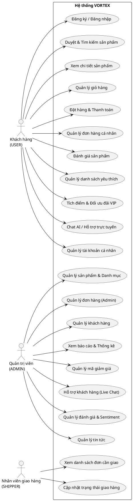
```plantuml
@startuml UC_TongQuan
left to right direction
skinparam packageStyle rectangle

actor "Khách hàng\n(USER)" as User
actor "Quản trị viên\n(ADMIN)" as Admin
actor "Nhân viên giao hàng\n(SHIPPER)" as Shipper

rectangle "Hệ thống VORTEX" {
  ' === Khách hàng ===
  usecase "Đăng ký / Đăng nhập" as UC1
  usecase "Duyệt & Tìm kiếm sản phẩm" as UC2
  usecase "Xem chi tiết sản phẩm" as UC3
  usecase "Quản lý giỏ hàng" as UC4
  usecase "Đặt hàng & Thanh toán" as UC5
  usecase "Quản lý đơn hàng cá nhân" as UC6
  usecase "Đánh giá sản phẩm" as UC7
  usecase "Quản lý danh sách yêu thích" as UC8
  usecase "Tích điểm & Đổi ưu đãi VIP" as UC9
  usecase "Chat AI / Hỗ trợ trực tuyến" as UC10
  usecase "Quản lý tài khoản cá nhân" as UC11

  ' === Quản trị viên ===
  usecase "Quản lý sản phẩm & Danh mục" as UC12
  usecase "Quản lý đơn hàng (Admin)" as UC13
  usecase "Quản lý khách hàng" as UC14
  usecase "Xem báo cáo & Thống kê" as UC15
  usecase "Quản lý mã giảm giá" as UC16
  usecase "Hỗ trợ khách hàng (Live Chat)" as UC17
  usecase "Quản lý đánh giá & Sentiment" as UC18
  usecase "Quản lý tin tức" as UC19

  ' === Nhân viên giao hàng ===
  usecase "Xem danh sách đơn cần giao" as UC20
  usecase "Cập nhật trạng thái giao hàng" as UC21
}

User --> UC1
User --> UC2
User --> UC3
User --> UC4
User --> UC5
User --> UC6
User --> UC7
User --> UC8
User --> UC9
User --> UC10
User --> UC11

Admin --> UC12
Admin --> UC13
Admin --> UC14
Admin --> UC15
Admin --> UC16
Admin --> UC17
Admin --> UC18
Admin --> UC19

Shipper --> UC20
Shipper --> UC21

@enduml
```

---

#### 3.1.3. Sơ đồ Use Case chi tiết

##### A. Use Case chi tiết – Quản lý tài khoản

> **Hình 3.2:** Sơ đồ Use Case chi tiết – Quản lý tài khoản

```
[📌 NOTE: Chèn ảnh sơ đồ UC chi tiết Quản lý tài khoản vào đây]
```

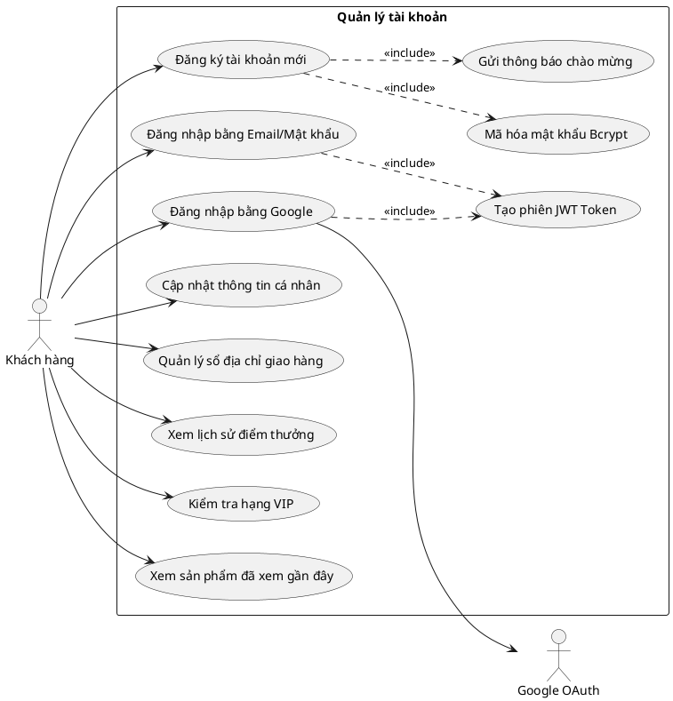
```plantuml
@startuml UC_TaiKhoan
left to right direction

actor "Khách hàng" as User
actor "Google OAuth" as Google

rectangle "Quản lý tài khoản" {
  usecase "Đăng ký tài khoản mới" as UC_DK
  usecase "Đăng nhập bằng Email/Mật khẩu" as UC_DN
  usecase "Đăng nhập bằng Google" as UC_GG
  usecase "Cập nhật thông tin cá nhân" as UC_CN
  usecase "Quản lý sổ địa chỉ giao hàng" as UC_DC
  usecase "Xem lịch sử điểm thưởng" as UC_DT
  usecase "Kiểm tra hạng VIP" as UC_VIP
  usecase "Xem sản phẩm đã xem gần đây" as UC_DX
  usecase "Mã hóa mật khẩu Bcrypt" as UC_BC
  usecase "Tạo phiên JWT Token" as UC_JWT
  usecase "Gửi thông báo chào mừng" as UC_TB
}

User --> UC_DK
User --> UC_DN
User --> UC_GG
User --> UC_CN
User --> UC_DC
User --> UC_DT
User --> UC_VIP
User --> UC_DX

UC_GG --> Google

UC_DK ..> UC_BC : <<include>>
UC_DK ..> UC_TB : <<include>>
UC_DN ..> UC_JWT : <<include>>
UC_GG ..> UC_JWT : <<include>>

@enduml
```

**Mô tả chi tiết các Use Case:**

| UC | Tên | Mô tả | Điều kiện tiên quyết |
|----|-----|-------|---------------------|
| UC_DK | Đăng ký tài khoản | Khách nhập Tên, Email, Mật khẩu. Hệ thống kiểm tra email trùng lặp, hash mật khẩu bằng Bcrypt (salt = 10), tạo tài khoản và gửi thông báo chào mừng | Chưa có tài khoản |
| UC_DN | Đăng nhập Email | Khách nhập Email + Mật khẩu. Hệ thống so khớp bằng bcrypt.compare(), tạo JWT token chứa userId, role, avatar | Đã có tài khoản |
| UC_GG | Đăng nhập Google | Khách bấm nút "Đăng nhập bằng Google". NextAuth xử lý OAuth flow, tự tạo tài khoản nếu chưa có | Có tài khoản Google |
| UC_CN | Cập nhật thông tin | Khách sửa tên, SĐT, ngày sinh, giới tính, ảnh đại diện | Đã đăng nhập |
| UC_DC | Sổ địa chỉ | Thêm / Sửa / Xóa / Đặt mặc định các địa chỉ giao hàng (Tỉnh/Quận/Phường/Đường) | Đã đăng nhập |
| UC_VIP | Kiểm tra VIP | Xem hạng VIP hiện tại, số điểm, tiến trình thăng hạng, đặc quyền | Đã đăng nhập |

---

##### B. Use Case chi tiết – Mua sắm & Thanh toán

> **Hình 3.3:** Sơ đồ Use Case chi tiết – Mua sắm & Thanh toán

```
[📌 NOTE: Chèn ảnh sơ đồ UC chi tiết Mua sắm & Thanh toán vào đây]
```

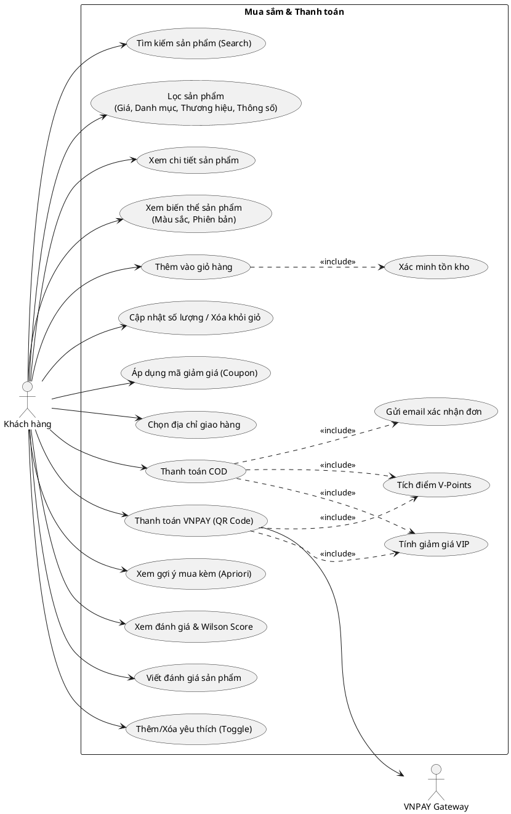
```plantuml
@startuml UC_MuaSam
left to right direction

actor "Khách hàng" as User
actor "VNPAY Gateway" as VNPAY

rectangle "Mua sắm & Thanh toán" {
  usecase "Tìm kiếm sản phẩm (Search)" as UC_TK
  usecase "Lọc sản phẩm\n(Giá, Danh mục, Thương hiệu, Thông số)" as UC_LOC
  usecase "Xem chi tiết sản phẩm" as UC_CT
  usecase "Xem biến thể sản phẩm\n(Màu sắc, Phiên bản)" as UC_BT
  usecase "Thêm vào giỏ hàng" as UC_GH
  usecase "Cập nhật số lượng / Xóa khỏi giỏ" as UC_SL
  usecase "Áp dụng mã giảm giá (Coupon)" as UC_MG
  usecase "Chọn địa chỉ giao hàng" as UC_ADR
  usecase "Thanh toán COD" as UC_COD
  usecase "Thanh toán VNPAY (QR Code)" as UC_VNP
  usecase "Xem gợi ý mua kèm (Apriori)" as UC_AP
  usecase "Xem đánh giá & Wilson Score" as UC_DG
  usecase "Viết đánh giá sản phẩm" as UC_VDG
  usecase "Thêm/Xóa yêu thích (Toggle)" as UC_YT
  usecase "Xác minh tồn kho" as UC_TK2
  usecase "Tính giảm giá VIP" as UC_VIPD
  usecase "Tích điểm V-Points" as UC_PTS
  usecase "Gửi email xác nhận đơn" as UC_EMAIL
}

User --> UC_TK
User --> UC_LOC
User --> UC_CT
User --> UC_BT
User --> UC_GH
User --> UC_SL
User --> UC_MG
User --> UC_ADR
User --> UC_COD
User --> UC_VNP
User --> UC_AP
User --> UC_DG
User --> UC_VDG
User --> UC_YT

UC_VNP --> VNPAY

UC_GH ..> UC_TK2 : <<include>>
UC_COD ..> UC_VIPD : <<include>>
UC_COD ..> UC_PTS : <<include>>
UC_COD ..> UC_EMAIL : <<include>>
UC_VNP ..> UC_VIPD : <<include>>
UC_VNP ..> UC_PTS : <<include>>

@enduml
```

---

##### C. Use Case chi tiết – Quản trị Admin

> **Hình 3.4:** Sơ đồ Use Case chi tiết – Quản trị Admin

```
[📌 NOTE: Chèn ảnh sơ đồ UC chi tiết Admin vào đây]
```

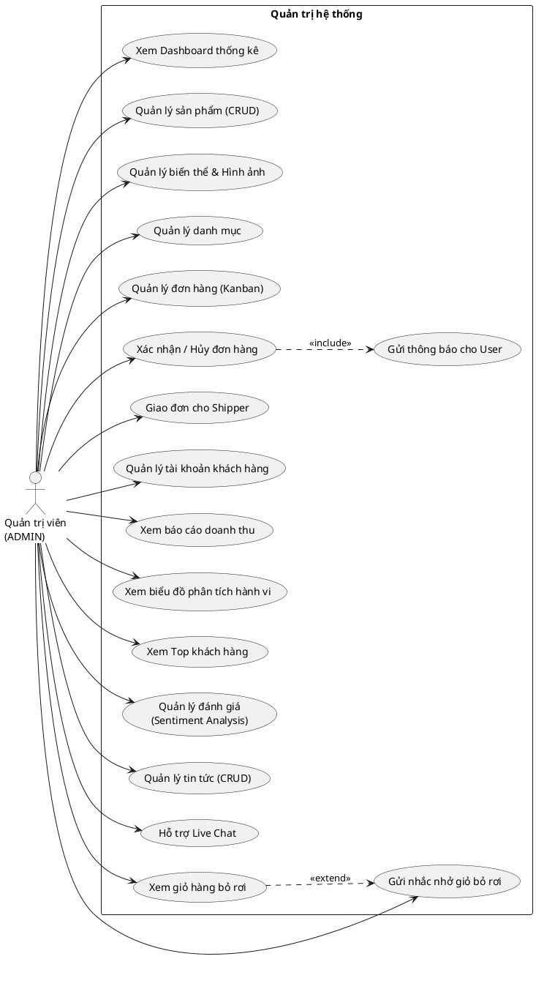
```plantuml
@startuml UC_Admin
left to right direction

actor "Quản trị viên\n(ADMIN)" as Admin

rectangle "Quản trị hệ thống" {
  usecase "Xem Dashboard thống kê" as UC_DB
  usecase "Quản lý sản phẩm (CRUD)" as UC_SP
  usecase "Quản lý biến thể & Hình ảnh" as UC_SPBT
  usecase "Quản lý danh mục" as UC_DM
  usecase "Quản lý đơn hàng (Kanban)" as UC_DH
  usecase "Xác nhận / Hủy đơn hàng" as UC_XN
  usecase "Giao đơn cho Shipper" as UC_GD
  usecase "Quản lý tài khoản khách hàng" as UC_KH
  usecase "Xem báo cáo doanh thu" as UC_DT
  usecase "Xem biểu đồ phân tích hành vi" as UC_HV
  usecase "Xem Top khách hàng" as UC_TKH
  usecase "Quản lý đánh giá\n(Sentiment Analysis)" as UC_SA
  usecase "Quản lý tin tức (CRUD)" as UC_TT
  usecase "Hỗ trợ Live Chat" as UC_LC
  usecase "Xem giỏ hàng bỏ rơi" as UC_GBR
  usecase "Gửi nhắc nhở giỏ bỏ rơi" as UC_NR
  usecase "Gửi thông báo cho User" as UC_TB
}

Admin --> UC_DB
Admin --> UC_SP
Admin --> UC_SPBT
Admin --> UC_DM
Admin --> UC_DH
Admin --> UC_XN
Admin --> UC_GD
Admin --> UC_KH
Admin --> UC_DT
Admin --> UC_HV
Admin --> UC_TKH
Admin --> UC_SA
Admin --> UC_TT
Admin --> UC_LC
Admin --> UC_GBR
Admin --> UC_NR

UC_XN ..> UC_TB : <<include>>
UC_GBR ..> UC_NR : <<extend>>

@enduml
```

---

##### D. Use Case chi tiết – Giao hàng (Shipper)

> **Hình 3.5:** Sơ đồ Use Case chi tiết – Giao hàng (Shipper)

```
[📌 NOTE: Chèn ảnh sơ đồ UC chi tiết Shipper vào đây]
```

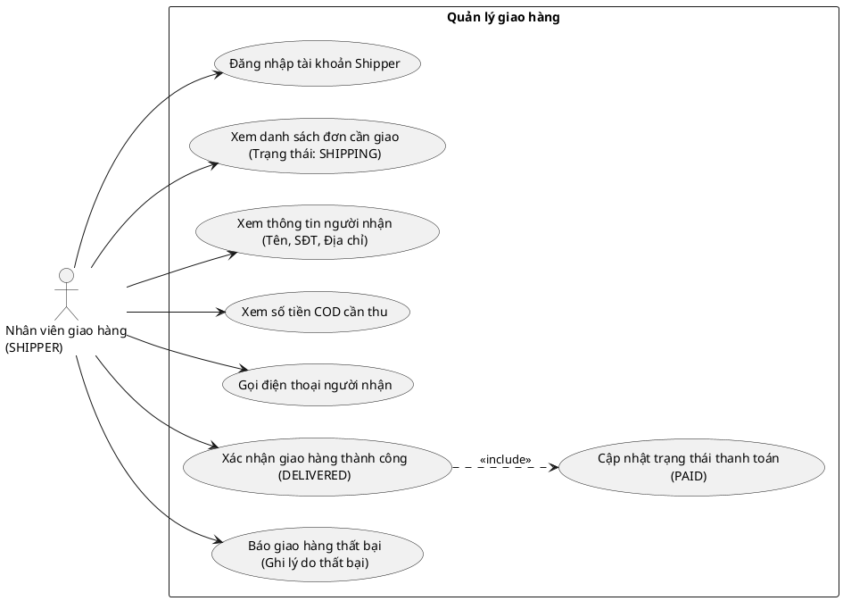
```plantuml
@startuml UC_Shipper
left to right direction

actor "Nhân viên giao hàng\n(SHIPPER)" as Shipper

rectangle "Quản lý giao hàng" {
  usecase "Đăng nhập tài khoản Shipper" as UC_DN
  usecase "Xem danh sách đơn cần giao\n(Trạng thái: SHIPPING)" as UC_DS
  usecase "Xem thông tin người nhận\n(Tên, SĐT, Địa chỉ)" as UC_TT
  usecase "Xem số tiền COD cần thu" as UC_COD
  usecase "Gọi điện thoại người nhận" as UC_CALL
  usecase "Xác nhận giao hàng thành công\n(DELIVERED)" as UC_OK
  usecase "Báo giao hàng thất bại\n(Ghi lý do thất bại)" as UC_FAIL
  usecase "Cập nhật trạng thái thanh toán\n(PAID)" as UC_PAY
}

Shipper --> UC_DN
Shipper --> UC_DS
Shipper --> UC_TT
Shipper --> UC_COD
Shipper --> UC_CALL
Shipper --> UC_OK
Shipper --> UC_FAIL

UC_OK ..> UC_PAY : <<include>>

@enduml
```

---

#### 3.1.4. Sơ đồ ERD – Quan hệ thực thể

> **Hình 3.6:** Sơ đồ ERD – Quan hệ thực thể cơ sở dữ liệu VORTEX

```
[📌 NOTE: Chèn ảnh sơ đồ ERD vào đây - Vẽ bằng Draw.io]
```

**Hệ thống VORTEX có 19 bảng dữ liệu** được quản lý bởi Prisma ORM trên SQLite:


```plantuml
@startuml ERD_VORTEX
!define table(x) entity x << (T, #FFAAAA) >>
skinparam linetype ortho

table(User) {
  *id : String <<PK, CUID>>
  --
  email : String <<UNIQUE>>
  name : String
  password : String?
  phone : String?
  avatar : String?
  image : String?
  gender : String?
  dob : DateTime?
  role : String [USER|ADMIN|SHIPPER]
  points : Int [default: 0]
  vipTier : String [MEMBER|SILVER|GOLD|DIAMOND]
  createdAt : DateTime
  updatedAt : DateTime
}

table(Account) {
  *id : String <<PK>>
  --
  userId : String <<FK>>
  type : String
  provider : String
  providerAccountId : String
  access_token : String?
  refresh_token : String?
}

table(Address) {
  *id : String <<PK>>
  --
  userId : String <<FK>>
  recipientName : String
  phoneNumber : String
  province : String
  district : String
  ward : String
  street : String
  isDefault : Boolean
}

table(Category) {
  *id : String <<PK>>
  --
  name : String
  slug : String <<UNIQUE>>
  parentGroup : String [gaming|tech]
  sortOrder : Int
  isActive : Boolean
}

table(Product) {
  *id : String <<PK>>
  --
  name : String
  slug : String <<UNIQUE>>
  description : String?
  specs : String? (JSON)
  features : String? (JSON)
  price : Float
  salePrice : Float?
  stock : Int
  brand : String?
  isActive : Boolean
  soldCount : Int
  wilsonScore : Float
  categoryId : String <<FK>>
}

table(ProductVariant) {
  *id : String <<PK>>
  --
  productId : String <<FK>>
  name : String
  sku : String?
  stock : Int
  priceOffset : Float
  specs : String? (JSON)
}

table(ProductImage) {
  *id : String <<PK>>
  --
  url : String
  alt : String?
  sortOrder : Int
  productId : String <<FK>>
  variantId : String? <<FK>>
}

table(CartItem) {
  *id : String <<PK>>
  --
  userId : String <<FK>>
  productId : String <<FK>>
  variantId : String? <<FK>>
  quantity : Int
}

table(Order) {
  *id : String <<PK>>
  --
  orderNumber : String <<UNIQUE>>
  userId : String <<FK>>
  totalAmount : Float
  shippingFee : Float
  discount : Float
  recipientName : String
  recipientPhone : String
  shippingAddress : String
  note : String?
  status : String [PENDING|CONFIRMED|PROCESSING|SHIPPING|DELIVERED|CANCELLED]
  cancelReason : String?
  paymentMethod : String [COD|VNPAY]
  paymentStatus : String [PENDING|PAID|FAILED|REFUNDED]
  couponCode : String? <<FK>>
}

table(OrderItem) {
  *id : String <<PK>>
  --
  orderId : String <<FK>>
  productId : String <<FK>>
  variantId : String? <<FK>>
  variantName : String?
  quantity : Int
  price : Float
}

table(Review) {
  *id : String <<PK>>
  --
  userId : String <<FK>>
  productId : String <<FK>>
  orderId : String? <<FK>>
  rating : Int [1-5]
  comment : String?
  createdAt : DateTime
}

table(Wishlist) {
  *id : String <<PK>>
  --
  userId : String <<FK>>
  productId : String <<FK>>
  createdAt : DateTime
}

table(ChatSession) {
  *id : String <<PK>>
  --
  userId : String?
  guestName : String
  status : String [AI|PENDING_HUMAN|HUMAN|CLOSED]
}

table(ChatMessage) {
  *id : String <<PK>>
  --
  sessionId : String <<FK>>
  senderType : String [USER|AI|STAFF]
  content : String
  createdAt : DateTime
}

table(Coupon) {
  *id : String <<PK>>
  --
  code : String <<UNIQUE>>
  discountPercent : Int?
  discountAmount : Int?
  minOrderValue : Int
  costInPoints : Int?
  maxUsage : Int
  usedCount : Int
  validUntil : DateTime
  isActive : Boolean
}

table(PointHistory) {
  *id : String <<PK>>
  --
  userId : String <<FK>>
  points : Int
  type : String [EARN_ORDER|REDEEM_COUPON|BONUS_BIRTHDAY|BONUS_NEW]
  description : String?
}

table(News) {
  *id : String <<PK>>
  --
  title : String
  slug : String <<UNIQUE>>
  author : String
  category : String
  description : String?
  content : String?
  image : String?
  isFeatured : Boolean
}

table(Notification) {
  *id : String <<PK>>
  --
  userId : String? <<FK>>
  targetRole : String [USER|ADMIN]
  type : String
  title : String
  message : String
  link : String?
  isRead : Boolean
}

table(ProductView) {
  *id : String <<PK>>
  --
  productId : String <<FK>>
  userId : String? <<FK>>
  sessionId : String
  viewDuration : Int (seconds)
  converted : Boolean
}

' === Relationships ===
User ||--o{ Account : "has"
User ||--o{ Address : "has"
User ||--o{ Order : "places"
User ||--o{ CartItem : "has"
User ||--o{ Review : "writes"
User ||--o{ Wishlist : "likes"
User ||--o{ PointHistory : "earns"
User ||--o{ Notification : "receives"
User ||--o{ ProductView : "views"

Category ||--o{ Product : "contains"
Product ||--o{ ProductVariant : "has"
Product ||--o{ ProductImage : "has"
Product ||--o{ OrderItem : "ordered in"
Product ||--o{ CartItem : "in cart"
Product ||--o{ Review : "reviewed"
Product ||--o{ Wishlist : "wishlisted"
Product ||--o{ ProductView : "tracked"

ProductVariant ||--o{ ProductImage : "has"
ProductVariant ||--o{ CartItem : "selected"
ProductVariant ||--o{ OrderItem : "ordered"

Order ||--o{ OrderItem : "contains"
Order ||--o{ Review : "relates to"
Coupon ||--o{ Order : "applied to"

ChatSession ||--o{ ChatMessage : "contains"

@enduml
```

> **Bảng 3.1:** Danh sách 19 bảng trong cơ sở dữ liệu VORTEX

| STT | Tên bảng | Mô tả | Số cột |
|-----|----------|-------|--------|
| 1 | users | Thông tin tài khoản người dùng | 14 |
| 2 | accounts | Liên kết OAuth (Google) | 10 |
| 3 | addresses | Sổ địa chỉ giao hàng | 9 |
| 4 | categories | Danh mục sản phẩm | 7 |
| 5 | products | Thông tin sản phẩm | 16 |
| 6 | product_variants | Biến thể sản phẩm (màu, phiên bản) | 8 |
| 7 | product_images | Hình ảnh sản phẩm | 5 |
| 8 | cart_items | Giỏ hàng người dùng | 6 |
| 9 | orders | Đơn hàng | 15 |
| 10 | order_items | Chi tiết mục trong đơn hàng | 7 |
| 11 | reviews | Đánh giá sản phẩm | 6 |
| 12 | wishlists | Danh sách yêu thích | 4 |
| 13 | chat_sessions | Phiên hội thoại chat | 5 |
| 14 | chat_messages | Tin nhắn trong phiên chat | 4 |
| 15 | coupons | Mã giảm giá / Phiếu ưu đãi | 11 |
| 16 | point_histories | Lịch sử giao dịch điểm thưởng | 5 |
| 17 | news | Tin tức & Bài viết | 10 |
| 18 | notifications | Thông báo hệ thống | 8 |
| 19 | product_views | Theo dõi lượt xem sản phẩm (Analytics) | 7 |

---

#### 3.1.5. Sơ đồ Sequence (Tuần tự)

##### A. Sequence Diagram – Đăng ký & Đăng nhập

> **Hình 3.7:** Sơ đồ Sequence – Luồng Đăng ký & Đăng nhập

```
[📌 NOTE: Chèn ảnh Sequence Diagram Đăng ký & Đăng nhập vào đây]
```

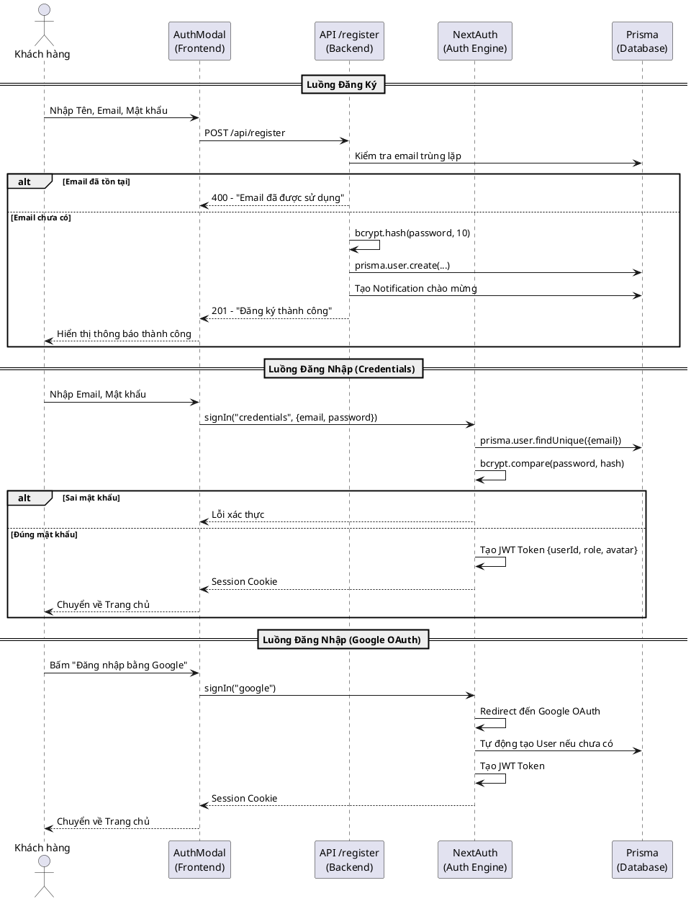
```plantuml
@startuml SEQ_DangKy_DangNhap
actor "Khách hàng" as User
participant "AuthModal\n(Frontend)" as UI
participant "API /register\n(Backend)" as RegAPI
participant "NextAuth\n(Auth Engine)" as Auth
participant "Prisma\n(Database)" as DB

== Luồng Đăng Ký ==
User -> UI : Nhập Tên, Email, Mật khẩu
UI -> RegAPI : POST /api/register
RegAPI -> DB : Kiểm tra email trùng lặp
alt Email đã tồn tại
  RegAPI --> UI : 400 - "Email đã được sử dụng"
else Email chưa có
  RegAPI -> RegAPI : bcrypt.hash(password, 10)
  RegAPI -> DB : prisma.user.create(...)
  RegAPI -> DB : Tạo Notification chào mừng
  RegAPI --> UI : 201 - "Đăng ký thành công"
  UI --> User : Hiển thị thông báo thành công
end

== Luồng Đăng Nhập (Credentials) ==
User -> UI : Nhập Email, Mật khẩu
UI -> Auth : signIn("credentials", {email, password})
Auth -> DB : prisma.user.findUnique({email})
Auth -> Auth : bcrypt.compare(password, hash)
alt Sai mật khẩu
  Auth --> UI : Lỗi xác thực
else Đúng mật khẩu
  Auth -> Auth : Tạo JWT Token {userId, role, avatar}
  Auth --> UI : Session Cookie
  UI --> User : Chuyển về Trang chủ
end

== Luồng Đăng Nhập (Google OAuth) ==
User -> UI : Bấm "Đăng nhập bằng Google"
UI -> Auth : signIn("google")
Auth -> Auth : Redirect đến Google OAuth
Auth -> DB : Tự động tạo User nếu chưa có
Auth -> Auth : Tạo JWT Token
Auth --> UI : Session Cookie
UI --> User : Chuyển về Trang chủ

@enduml
```

---

##### B. Sequence Diagram – Đặt hàng & Thanh toán

> **Hình 3.8:** Sơ đồ Sequence – Luồng Đặt hàng & Thanh toán

```
[📌 NOTE: Chèn ảnh Sequence Diagram Đặt hàng & Thanh toán vào đây]
```

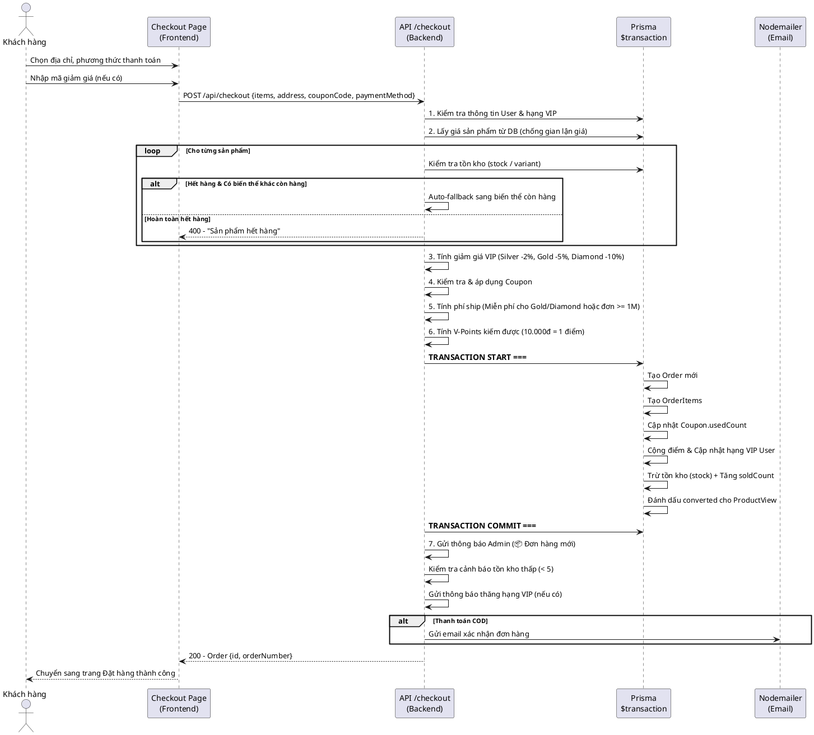
```plantuml
@startuml SEQ_DatHang
actor "Khách hàng" as User
participant "Checkout Page\n(Frontend)" as UI
participant "API /checkout\n(Backend)" as API
participant "Prisma\n$transaction" as DB
participant "Nodemailer\n(Email)" as Mail

User -> UI : Chọn địa chỉ, phương thức thanh toán
User -> UI : Nhập mã giảm giá (nếu có)
UI -> API : POST /api/checkout {items, address, couponCode, paymentMethod}

API -> DB : 1. Kiểm tra thông tin User & hạng VIP
API -> DB : 2. Lấy giá sản phẩm từ DB (chống gian lận giá)

loop Cho từng sản phẩm
  API -> DB : Kiểm tra tồn kho (stock / variant)
  alt Hết hàng & Có biến thể khác còn hàng
    API -> API : Auto-fallback sang biến thể còn hàng
  else Hoàn toàn hết hàng
    API --> UI : 400 - "Sản phẩm hết hàng"
  end
end

API -> API : 3. Tính giảm giá VIP (Silver -2%, Gold -5%, Diamond -10%)
API -> API : 4. Kiểm tra & áp dụng Coupon
API -> API : 5. Tính phí ship (Miễn phí cho Gold/Diamond hoặc đơn >= 1M)
API -> API : 6. Tính V-Points kiếm được (10.000đ = 1 điểm)

API -> DB : === TRANSACTION START ===
DB -> DB : Tạo Order mới
DB -> DB : Tạo OrderItems
DB -> DB : Cập nhật Coupon.usedCount
DB -> DB : Cộng điểm & Cập nhật hạng VIP User
DB -> DB : Trừ tồn kho (stock) + Tăng soldCount
DB -> DB : Đánh dấu converted cho ProductView
API -> DB : === TRANSACTION COMMIT ===

API -> API : 7. Gửi thông báo Admin (📦 Đơn hàng mới)
API -> API : Kiểm tra cảnh báo tồn kho thấp (< 5)
API -> API : Gửi thông báo thăng hạng VIP (nếu có)

alt Thanh toán COD
  API -> Mail : Gửi email xác nhận đơn hàng
end

API --> UI : 200 - Order {id, orderNumber}
UI --> User : Chuyển sang trang Đặt hàng thành công

@enduml
```

---

##### C. Sequence Diagram – Thanh toán VNPAY

> **Hình 3.9:** Sơ đồ Sequence – Luồng Thanh toán VNPAY

```
[📌 NOTE: Chèn ảnh Sequence Diagram VNPAY vào đây]
```

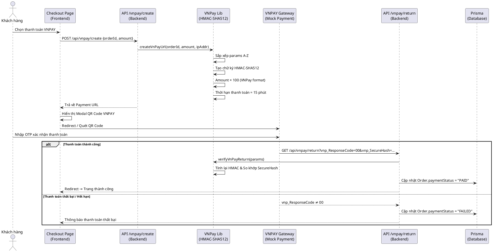
```plantuml
@startuml SEQ_VNPAY
actor "Khách hàng" as User
participant "Checkout Page\n(Frontend)" as UI
participant "API /vnpay/create\n(Backend)" as CreateAPI
participant "VNPay Lib\n(HMAC-SHA512)" as VNLib
participant "VNPAY Gateway\n(Mock Payment)" as Gateway
participant "API /vnpay/return\n(Backend)" as ReturnAPI
participant "Prisma\n(Database)" as DB

User -> UI : Chọn thanh toán VNPAY
UI -> CreateAPI : POST /api/vnpay/create {orderId, amount}
CreateAPI -> VNLib : createVnPayUrl(orderId, amount, ipAddr)
VNLib -> VNLib : Sắp xếp params A-Z
VNLib -> VNLib : Tạo chữ ký HMAC-SHA512
VNLib -> VNLib : Amount × 100 (VNPay format)
VNLib -> VNLib : Thời hạn thanh toán = 15 phút
CreateAPI --> UI : Trả về Payment URL

UI -> UI : Hiển thị Modal QR Code VNPAY
UI -> Gateway : Redirect / Quét QR Code
User -> Gateway : Nhập OTP xác nhận thanh toán

alt Thanh toán thành công
  Gateway -> ReturnAPI : GET /api/vnpay/return?vnp_ResponseCode=00&vnp_SecureHash=...
  ReturnAPI -> VNLib : verifyVnPayReturn(params)
  VNLib -> VNLib : Tính lại HMAC & So khớp SecureHash
  ReturnAPI -> DB : Cập nhật Order.paymentStatus = "PAID"
  ReturnAPI --> UI : Redirect → Trang thành công
else Thanh toán thất bại / Hết hạn
  Gateway --> ReturnAPI : vnp_ResponseCode ≠ 00
  ReturnAPI -> DB : Cập nhật Order.paymentStatus = "FAILED"
  ReturnAPI --> UI : Thông báo thanh toán thất bại
end

@enduml
```

---

##### D. Sequence Diagram – Gợi ý mua kèm (Apriori Algorithm)

> **Hình 3.10:** Sơ đồ Sequence – Luồng Gợi ý mua kèm (Apriori)

```
[📌 NOTE: Chèn ảnh Sequence Diagram Apriori vào đây]
```

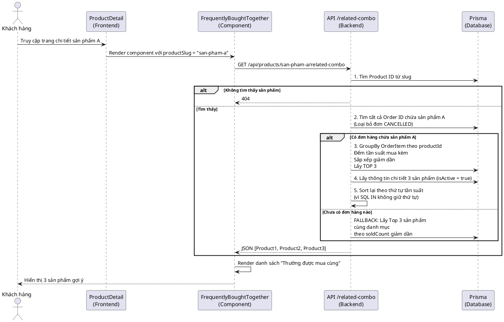
```plantuml
@startuml SEQ_Apriori
actor "Khách hàng" as User
participant "ProductDetail\n(Frontend)" as UI
participant "FrequentlyBoughtTogether\n(Component)" as FBT
participant "API /related-combo\n(Backend)" as API
participant "Prisma\n(Database)" as DB

User -> UI : Truy cập trang chi tiết sản phẩm A
UI -> FBT : Render component với productSlug = "san-pham-a"

FBT -> API : GET /api/products/san-pham-a/related-combo

API -> DB : 1. Tìm Product ID từ slug
alt Không tìm thấy sản phẩm
  API --> FBT : 404
else Tìm thấy
  API -> DB : 2. Tìm tất cả Order ID chứa sản phẩm A\n(Loại bỏ đơn CANCELLED)
  
  alt Có đơn hàng chứa sản phẩm A
    API -> DB : 3. GroupBy OrderItem theo productId\nĐếm tần suất mua kèm\nSắp xếp giảm dần\nLấy TOP 3
    API -> DB : 4. Lấy thông tin chi tiết 3 sản phẩm (isActive = true)
    API -> API : 5. Sort lại theo thứ tự tần suất\n(vì SQL IN không giữ thứ tự)
  else Chưa có đơn hàng nào
    API -> DB : FALLBACK: Lấy Top 3 sản phẩm\ncùng danh mục\ntheo soldCount giảm dần
  end
  
  API --> FBT : JSON [Product1, Product2, Product3]
end

FBT -> FBT : Render danh sách "Thường được mua cùng"
FBT --> User : Hiển thị 3 sản phẩm gợi ý

@enduml
```

---

##### E. Sequence Diagram – AI Chatbot

> **Hình 3.11:** Sơ đồ Sequence – Luồng AI Chatbot

```
[📌 NOTE: Chèn ảnh Sequence Diagram AI Chatbot vào đây]
```

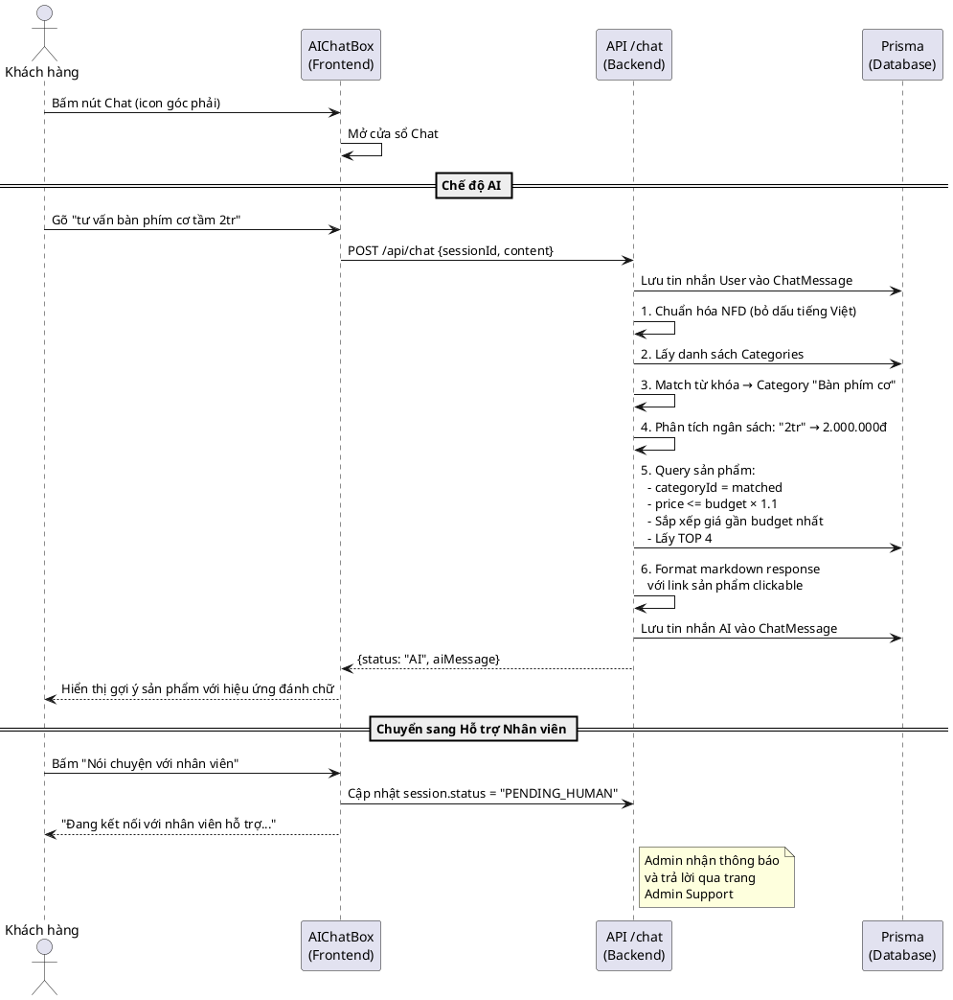
```plantuml
@startuml SEQ_Chatbot
actor "Khách hàng" as User
participant "AIChatBox\n(Frontend)" as UI
participant "API /chat\n(Backend)" as API
participant "Prisma\n(Database)" as DB

User -> UI : Bấm nút Chat (icon góc phải)
UI -> UI : Mở cửa sổ Chat

== Chế độ AI ==
User -> UI : Gõ "tư vấn bàn phím cơ tầm 2tr"
UI -> API : POST /api/chat {sessionId, content}

API -> DB : Lưu tin nhắn User vào ChatMessage

API -> API : 1. Chuẩn hóa NFD (bỏ dấu tiếng Việt)
API -> DB : 2. Lấy danh sách Categories
API -> API : 3. Match từ khóa → Category "Bàn phím cơ"
API -> API : 4. Phân tích ngân sách: "2tr" → 2.000.000đ

API -> DB : 5. Query sản phẩm:\n  - categoryId = matched\n  - price <= budget × 1.1\n  - Sắp xếp giá gần budget nhất\n  - Lấy TOP 4

API -> API : 6. Format markdown response\n  với link sản phẩm clickable

API -> DB : Lưu tin nhắn AI vào ChatMessage
API --> UI : {status: "AI", aiMessage}
UI --> User : Hiển thị gợi ý sản phẩm với hiệu ứng đánh chữ

== Chuyển sang Hỗ trợ Nhân viên ==
User -> UI : Bấm "Nói chuyện với nhân viên"
UI -> API : Cập nhật session.status = "PENDING_HUMAN"
UI --> User : "Đang kết nối với nhân viên hỗ trợ..."

note right of API
  Admin nhận thông báo
  và trả lời qua trang
  Admin Support
end note

@enduml
```

---

##### F. Sequence Diagram – VIP & Tích điểm

> **Hình 3.12:** Sơ đồ Sequence – Luồng VIP & Tích điểm

```
[📌 NOTE: Chèn ảnh Sequence Diagram VIP vào đây]
```

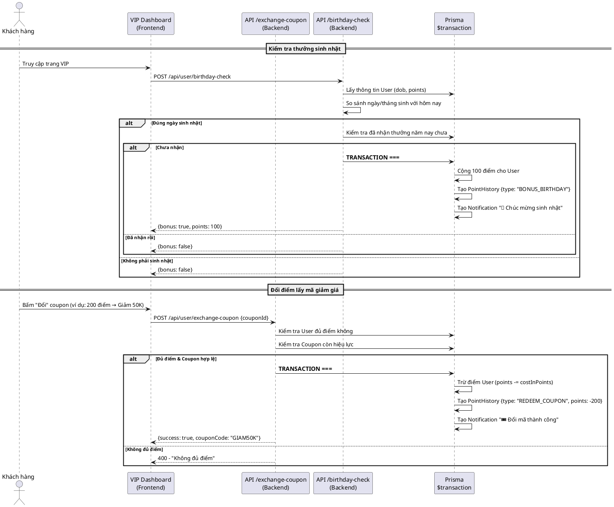
```plantuml
@startuml SEQ_VIP
actor "Khách hàng" as User
participant "VIP Dashboard\n(Frontend)" as UI
participant "API /exchange-coupon\n(Backend)" as ExAPI
participant "API /birthday-check\n(Backend)" as BdAPI
participant "Prisma\n$transaction" as DB

== Kiểm tra thưởng sinh nhật ==
User -> UI : Truy cập trang VIP
UI -> BdAPI : POST /api/user/birthday-check

BdAPI -> DB : Lấy thông tin User (dob, points)
BdAPI -> BdAPI : So sánh ngày/tháng sinh với hôm nay

alt Đúng ngày sinh nhật
  BdAPI -> DB : Kiểm tra đã nhận thưởng năm nay chưa
  alt Chưa nhận
    BdAPI -> DB : === TRANSACTION ===
    DB -> DB : Cộng 100 điểm cho User
    DB -> DB : Tạo PointHistory {type: "BONUS_BIRTHDAY"}
    DB -> DB : Tạo Notification "🎂 Chúc mừng sinh nhật"
    BdAPI --> UI : {bonus: true, points: 100}
  else Đã nhận rồi
    BdAPI --> UI : {bonus: false}
  end
else Không phải sinh nhật
  BdAPI --> UI : {bonus: false}
end

== Đổi điểm lấy mã giảm giá ==
User -> UI : Bấm "Đổi" coupon (ví dụ: 200 điểm → Giảm 50K)
UI -> ExAPI : POST /api/user/exchange-coupon {couponId}

ExAPI -> DB : Kiểm tra User đủ điểm không
ExAPI -> DB : Kiểm tra Coupon còn hiệu lực

alt Đủ điểm & Coupon hợp lệ
  ExAPI -> DB : === TRANSACTION ===
  DB -> DB : Trừ điểm User (points -= costInPoints)
  DB -> DB : Tạo PointHistory {type: "REDEEM_COUPON", points: -200}
  DB -> DB : Tạo Notification "🎟️ Đổi mã thành công"
  ExAPI --> UI : {success: true, couponCode: "GIAM50K"}
else Không đủ điểm
  ExAPI --> UI : 400 - "Không đủ điểm"
end

@enduml
```

---

##### G. Sequence Diagram – Yêu thích sản phẩm

> **Hình 3.13:** Sơ đồ Sequence – Luồng Yêu thích sản phẩm

```
[📌 NOTE: Chèn ảnh Sequence Diagram Wishlist vào đây]
```

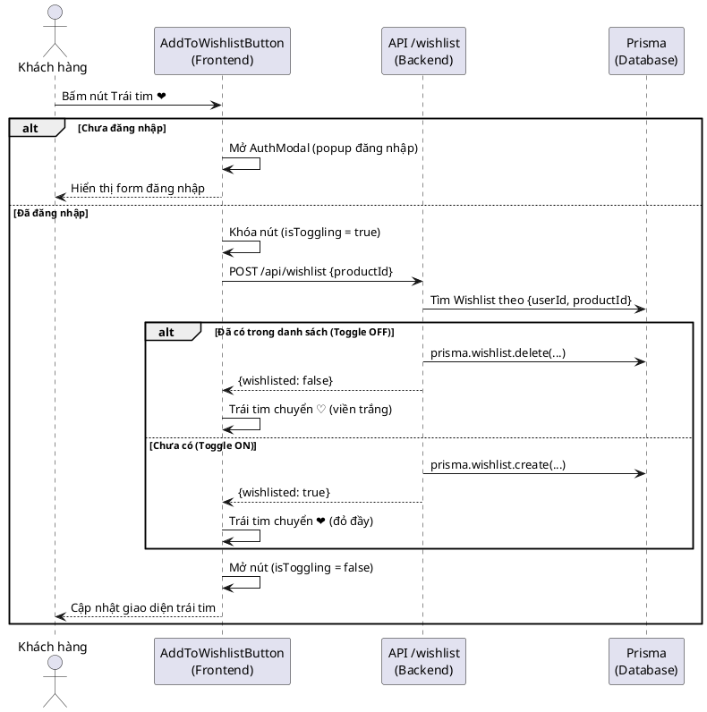
```plantuml
@startuml SEQ_Wishlist
actor "Khách hàng" as User
participant "AddToWishlistButton\n(Frontend)" as Btn
participant "API /wishlist\n(Backend)" as API
participant "Prisma\n(Database)" as DB

User -> Btn : Bấm nút Trái tim ❤️

alt Chưa đăng nhập
  Btn -> Btn : Mở AuthModal (popup đăng nhập)
  Btn --> User : Hiển thị form đăng nhập
else Đã đăng nhập
  Btn -> Btn : Khóa nút (isToggling = true)
  Btn -> API : POST /api/wishlist {productId}
  
  API -> DB : Tìm Wishlist theo {userId, productId}
  
  alt Đã có trong danh sách (Toggle OFF)
    API -> DB : prisma.wishlist.delete(...)
    API --> Btn : {wishlisted: false}
    Btn -> Btn : Trái tim chuyển ♡ (viền trắng)
  else Chưa có (Toggle ON)
    API -> DB : prisma.wishlist.create(...)
    API --> Btn : {wishlisted: true}
    Btn -> Btn : Trái tim chuyển ❤️ (đỏ đầy)
  end
  
  Btn -> Btn : Mở nút (isToggling = false)
  Btn --> User : Cập nhật giao diện trái tim
end

@enduml
```

---

##### H. Sequence Diagram – Quản lý đơn hàng (Admin)

> **Hình 3.14:** Sơ đồ Sequence – Luồng Quản lý đơn hàng (Admin)

```
[📌 NOTE: Chèn ảnh Sequence Diagram Admin Orders vào đây]
```

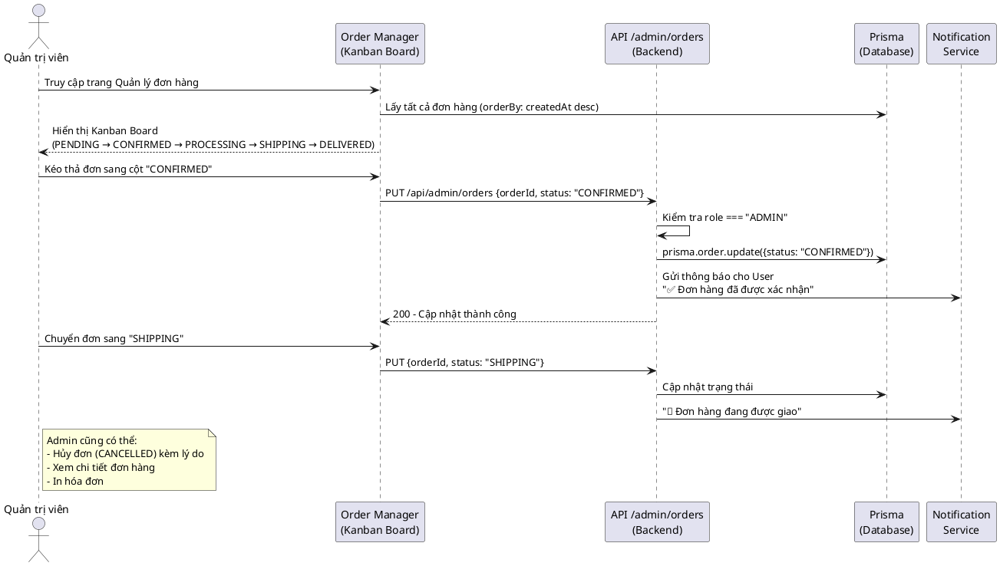
```plantuml
@startuml SEQ_AdminOrder
actor "Quản trị viên" as Admin
participant "Order Manager\n(Kanban Board)" as UI
participant "API /admin/orders\n(Backend)" as API
participant "Prisma\n(Database)" as DB
participant "Notification\nService" as Noti

Admin -> UI : Truy cập trang Quản lý đơn hàng
UI -> DB : Lấy tất cả đơn hàng (orderBy: createdAt desc)
UI --> Admin : Hiển thị Kanban Board\n(PENDING → CONFIRMED → PROCESSING → SHIPPING → DELIVERED)

Admin -> UI : Kéo thả đơn sang cột "CONFIRMED"
UI -> API : PUT /api/admin/orders {orderId, status: "CONFIRMED"}

API -> API : Kiểm tra role === "ADMIN"
API -> DB : prisma.order.update({status: "CONFIRMED"})
API -> Noti : Gửi thông báo cho User\n"✅ Đơn hàng đã được xác nhận"
API --> UI : 200 - Cập nhật thành công

Admin -> UI : Chuyển đơn sang "SHIPPING"
UI -> API : PUT {orderId, status: "SHIPPING"}
API -> DB : Cập nhật trạng thái
API -> Noti : "🚚 Đơn hàng đang được giao"

note right of Admin
  Admin cũng có thể:
  - Hủy đơn (CANCELLED) kèm lý do
  - Xem chi tiết đơn hàng
  - In hóa đơn
end note

@enduml
```

---

##### I. Sequence Diagram – Giao hàng (Shipper)

> **Hình 3.15:** Sơ đồ Sequence – Luồng Giao hàng (Shipper)

```
[📌 NOTE: Chèn ảnh Sequence Diagram Shipper vào đây]
```

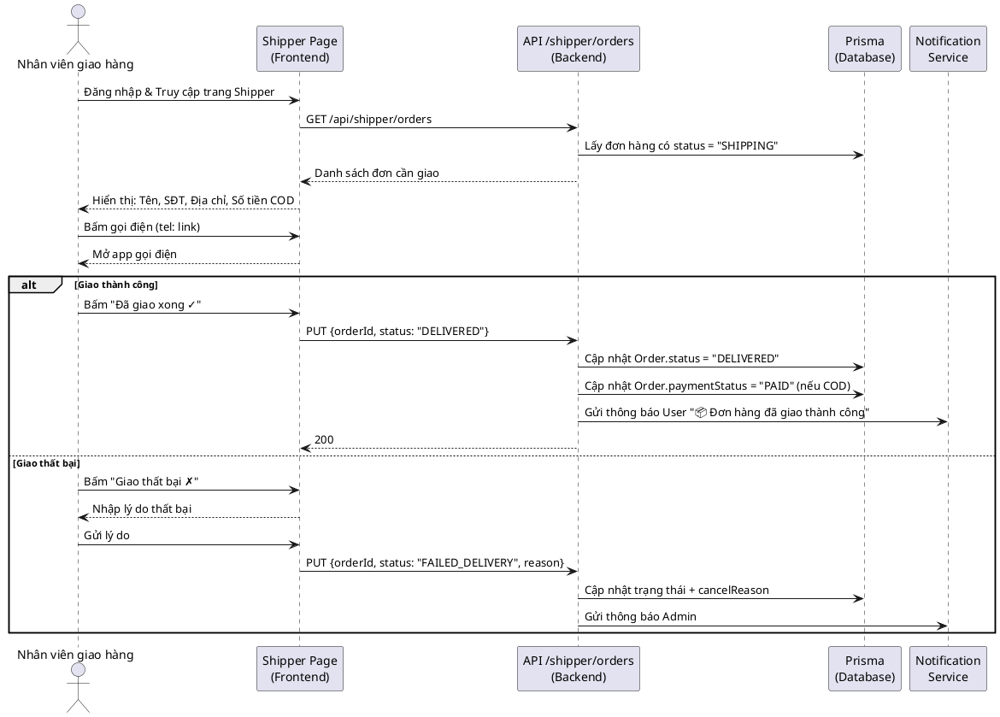
```plantuml
@startuml SEQ_Shipper
actor "Nhân viên giao hàng" as Shipper
participant "Shipper Page\n(Frontend)" as UI
participant "API /shipper/orders\n(Backend)" as API
participant "Prisma\n(Database)" as DB
participant "Notification\nService" as Noti

Shipper -> UI : Đăng nhập & Truy cập trang Shipper
UI -> API : GET /api/shipper/orders
API -> DB : Lấy đơn hàng có status = "SHIPPING"
API --> UI : Danh sách đơn cần giao
UI --> Shipper : Hiển thị: Tên, SĐT, Địa chỉ, Số tiền COD

Shipper -> UI : Bấm gọi điện (tel: link)
UI --> Shipper : Mở app gọi điện

alt Giao thành công
  Shipper -> UI : Bấm "Đã giao xong ✓"
  UI -> API : PUT {orderId, status: "DELIVERED"}
  API -> DB : Cập nhật Order.status = "DELIVERED"
  API -> DB : Cập nhật Order.paymentStatus = "PAID" (nếu COD)
  API -> Noti : Gửi thông báo User "📦 Đơn hàng đã giao thành công"
  API --> UI : 200
else Giao thất bại
  Shipper -> UI : Bấm "Giao thất bại ✗"
  UI --> Shipper : Nhập lý do thất bại
  Shipper -> UI : Gửi lý do
  UI -> API : PUT {orderId, status: "FAILED_DELIVERY", reason}
  API -> DB : Cập nhật trạng thái + cancelReason
  API -> Noti : Gửi thông báo Admin
end

@enduml
```

---

#### 3.1.6. Sơ đồ Activity (Hoạt động)

##### A. Activity Diagram – Quy trình Đặt hàng

> **Hình 3.16:** Sơ đồ Activity – Quy trình Đặt hàng

```
[📌 NOTE: Chèn ảnh Activity Diagram Đặt hàng vào đây]
```

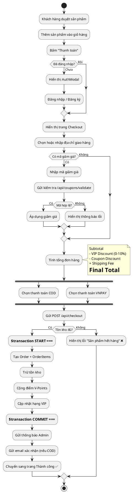
```plantuml
@startuml ACT_DatHang
start

:Khách hàng duyệt sản phẩm;
:Thêm sản phẩm vào giỏ hàng;
:Bấm "Thanh toán";

if (Đã đăng nhập?) then (Chưa)
  :Hiển thị AuthModal;
  :Đăng nhập / Đăng ký;
else (Rồi)
endif

:Hiển thị trang Checkout;
:Chọn hoặc nhập địa chỉ giao hàng;

if (Có mã giảm giá?) then (Có)
  :Nhập mã giảm giá;
  :Gửi kiểm tra /api/coupons/validate;
  if (Mã hợp lệ?) then (Có)
    :Áp dụng giảm giá;
  else (Không)
    :Hiển thị thông báo lỗi;
  endif
else (Không)
endif

:Tính tổng đơn hàng;
note right
  Subtotal
  - VIP Discount (0-10%)
  - Coupon Discount
  + Shipping Fee
  = **Final Total**
end note

fork
  :Chọn thanh toán COD;
fork again
  :Chọn thanh toán VNPAY;
end fork

:Gửi POST /api/checkout;

if (Tồn kho đủ?) then (Có)
  :=== $transaction START ===;
  :Tạo Order + OrderItems;
  :Trừ tồn kho;
  :Cộng điểm V-Points;
  :Cập nhật hạng VIP;
  :=== $transaction COMMIT ===;
  
  :Gửi thông báo Admin;
  :Gửi email xác nhận (nếu COD);
  :Chuyển sang trang Thành công ✅;
else (Không)
  :Hiển thị lỗi "Sản phẩm hết hàng" ❌;
endif

stop
@enduml
```

---

##### B. Activity Diagram – Quy trình Thanh toán VNPAY

> **Hình 3.17:** Sơ đồ Activity – Quy trình Thanh toán VNPAY

```
[📌 NOTE: Chèn ảnh Activity Diagram VNPAY vào đây]
```

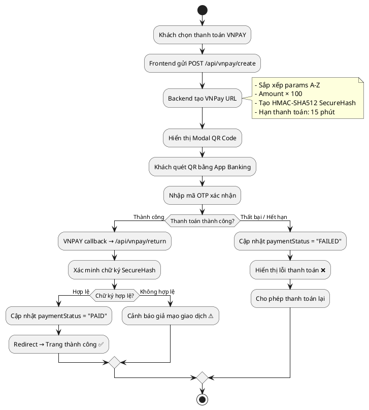
```plantuml
@startuml ACT_VNPAY
start

:Khách chọn thanh toán VNPAY;
:Frontend gửi POST /api/vnpay/create;

:Backend tạo VNPay URL;
note right
  - Sắp xếp params A-Z
  - Amount × 100
  - Tạo HMAC-SHA512 SecureHash
  - Hạn thanh toán: 15 phút
end note

:Hiển thị Modal QR Code;
:Khách quét QR bằng App Banking;
:Nhập mã OTP xác nhận;

if (Thanh toán thành công?) then (Thành công)
  :VNPAY callback → /api/vnpay/return;
  :Xác minh chữ ký SecureHash;
  
  if (Chữ ký hợp lệ?) then (Hợp lệ)
    :Cập nhật paymentStatus = "PAID";
    :Redirect → Trang thành công ✅;
  else (Không hợp lệ)
    :Cảnh báo giả mạo giao dịch ⚠️;
  endif
else (Thất bại / Hết hạn)
  :Cập nhật paymentStatus = "FAILED";
  :Hiển thị lỗi thanh toán ❌;
  :Cho phép thanh toán lại;
endif

stop
@enduml
```

---

##### C. Activity Diagram – Quy trình Xử lý đơn hàng (Admin → Shipper)

> **Hình 3.18:** Sơ đồ Activity – Quy trình Xử lý đơn hàng (Admin → Shipper)

```
[📌 NOTE: Chèn ảnh Activity Diagram Xử lý đơn hàng vào đây]
```

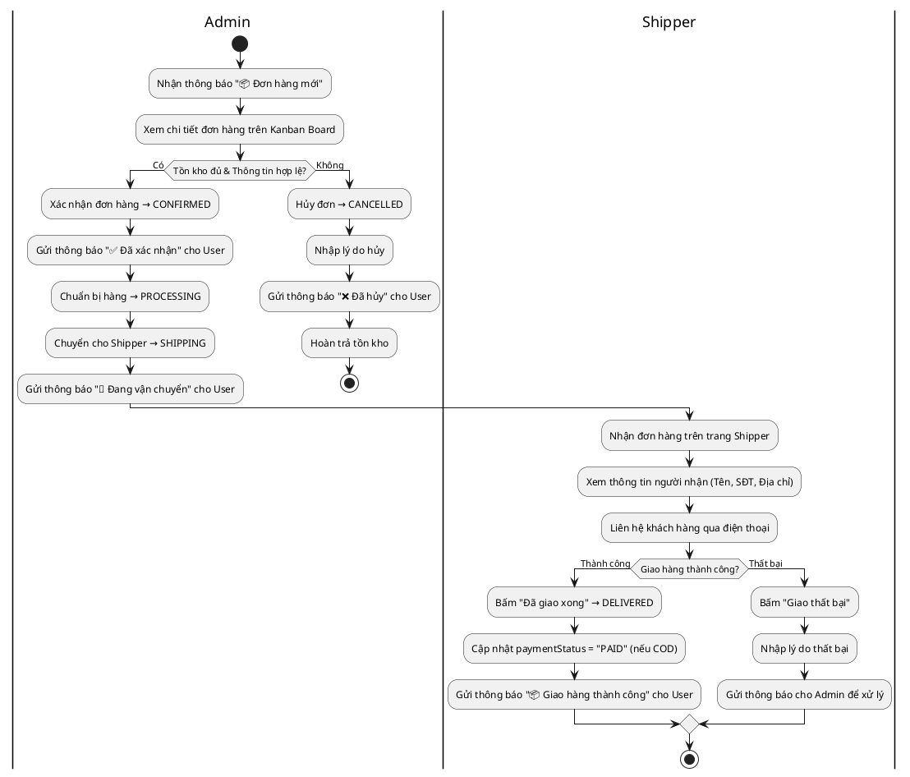
```plantuml
@startuml ACT_OrderFlow
|Admin|
start
:Nhận thông báo "📦 Đơn hàng mới";
:Xem chi tiết đơn hàng trên Kanban Board;

if (Tồn kho đủ & Thông tin hợp lệ?) then (Có)
  :Xác nhận đơn hàng → CONFIRMED;
  :Gửi thông báo "✅ Đã xác nhận" cho User;
  :Chuẩn bị hàng → PROCESSING;
  :Chuyển cho Shipper → SHIPPING;
  :Gửi thông báo "🚚 Đang vận chuyển" cho User;
else (Không)
  :Hủy đơn → CANCELLED;
  :Nhập lý do hủy;
  :Gửi thông báo "❌ Đã hủy" cho User;
  :Hoàn trả tồn kho;
  stop
endif

|Shipper|
:Nhận đơn hàng trên trang Shipper;
:Xem thông tin người nhận (Tên, SĐT, Địa chỉ);
:Liên hệ khách hàng qua điện thoại;

if (Giao hàng thành công?) then (Thành công)
  :Bấm "Đã giao xong" → DELIVERED;
  :Cập nhật paymentStatus = "PAID" (nếu COD);
  :Gửi thông báo "📦 Giao hàng thành công" cho User;
else (Thất bại)
  :Bấm "Giao thất bại";
  :Nhập lý do thất bại;
  :Gửi thông báo cho Admin để xử lý;
endif

stop
@enduml
```

---

##### D. Activity Diagram – Quy trình Lọc & Tìm kiếm sản phẩm

> **Hình 3.19:** Sơ đồ Activity – Quy trình Lọc & Tìm kiếm sản phẩm

```
[📌 NOTE: Chèn ảnh Activity Diagram Lọc sản phẩm vào đây]
```

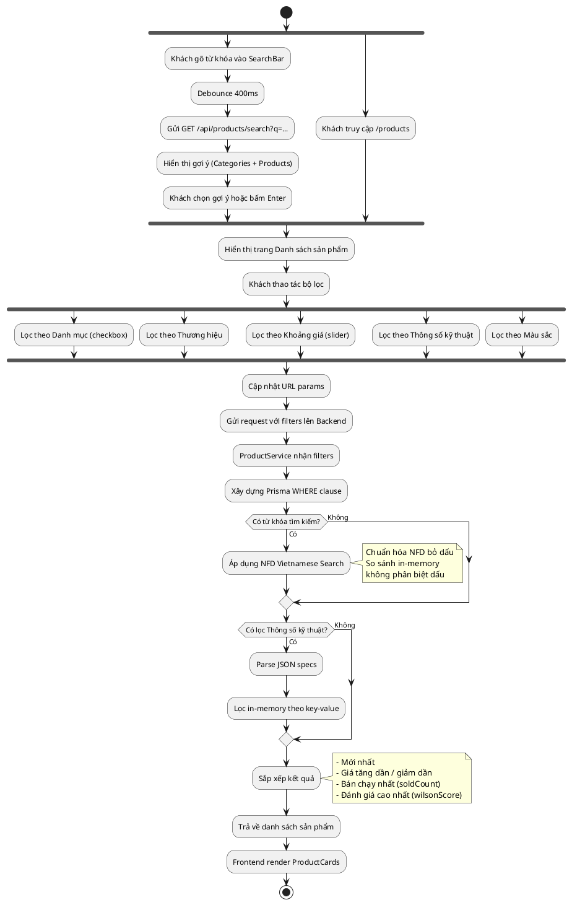
```plantuml
@startuml ACT_LocSanPham
start

fork
  :Khách gõ từ khóa vào SearchBar;
  :Debounce 400ms;
  :Gửi GET /api/products/search?q=...;
  :Hiển thị gợi ý (Categories + Products);
  :Khách chọn gợi ý hoặc bấm Enter;
fork again
  :Khách truy cập /products;
end fork

:Hiển thị trang Danh sách sản phẩm;

:Khách thao tác bộ lọc;
fork
  :Lọc theo Danh mục (checkbox);
fork again
  :Lọc theo Thương hiệu;
fork again
  :Lọc theo Khoảng giá (slider);
fork again
  :Lọc theo Thông số kỹ thuật;
fork again
  :Lọc theo Màu sắc;
end fork

:Cập nhật URL params;
:Gửi request với filters lên Backend;

:ProductService nhận filters;
:Xây dựng Prisma WHERE clause;

if (Có từ khóa tìm kiếm?) then (Có)
  :Áp dụng NFD Vietnamese Search;
  note right
    Chuẩn hóa NFD bỏ dấu
    So sánh in-memory
    không phân biệt dấu
  end note
else (Không)
endif

if (Có lọc Thông số kỹ thuật?) then (Có)
  :Parse JSON specs;
  :Lọc in-memory theo key-value;
else (Không)
endif

:Sắp xếp kết quả;
note right
  - Mới nhất
  - Giá tăng dần / giảm dần
  - Bán chạy nhất (soldCount)
  - Đánh giá cao nhất (wilsonScore)
end note

:Trả về danh sách sản phẩm;
:Frontend render ProductCards;

stop
@enduml
```

---

##### E. Activity Diagram – Quy trình VIP Tích điểm & Đổi Coupon

> **Hình 3.20:** Sơ đồ Activity – Quy trình VIP Tích điểm & Đổi Coupon

```
[📌 NOTE: Chèn ảnh Activity Diagram VIP vào đây]
```

```plantuml
@startuml ACT_VIP
start

:Khách truy cập trang VIP Dashboard;

== Kiểm tra sinh nhật ==
:Gửi POST /api/user/birthday-check;

if (Hôm nay là sinh nhật?) then (Đúng)
  if (Đã nhận thưởng năm nay?) then (Chưa)
    :Cộng 100 điểm thưởng sinh nhật;
    :Tạo PointHistory {BONUS_BIRTHDAY};
    :Gửi thông báo "🎂 Chúc mừng sinh nhật";
  else (Rồi)
    :Bỏ qua;
  endif
else (Không)
  :Bỏ qua;
endif

== Hiển thị Dashboard ==
:Hiển thị hạng VIP hiện tại;
note right
  MEMBER: 0 điểm
  SILVER: 500 điểm (+2%)
  GOLD: 2.000 điểm (+5%, Free Ship)
  DIAMOND: 5.000 điểm (+10%, Free Ship)
end note

:Hiển thị thanh tiến trình thăng hạng;
:Hiển thị lịch sử giao dịch điểm;

== Đổi điểm lấy Coupon ==
:Hiển thị danh sách Coupon có thể đổi;

if (Khách bấm "Đổi"?) then (Có)
  if (Đủ điểm?) then (Đủ)
    :=== TRANSACTION ===;
    :Trừ điểm User;
    :Tạo PointHistory {REDEEM_COUPON, points: -X};
    :Tạo Notification "🎟️ Đổi mã thành công";
    :Hiển thị mã giảm giá mới ✅;
  else (Thiếu)
    :Hiển thị lỗi "Không đủ điểm" ❌;
  endif
else (Không)
endif

stop
@enduml
```

---

### 3.2. Kế hoạch thời gian và ngân sách thực hiện dự án

#### 3.2.1. Kế hoạch thời gian (Gantt Chart)

> **Bảng 3.6:** Kế hoạch thời gian thực hiện dự án

| STT | Giai đoạn | Công việc | Thời gian | Tuần |
|-----|-----------|-----------|-----------|------|
| 1 | Phân tích yêu cầu | Thu thập yêu cầu, phân tích nghiệp vụ, khảo sát thị trường | Tuần 1-2 | 2 tuần |
| 2 | Thiết kế hệ thống | Thiết kế ERD, Use Case, Sequence, Activity, Wireframe UI | Tuần 3-4 | 2 tuần |
| 3 | Thiết kế Database | Xây dựng Prisma Schema, seed data | Tuần 5 | 1 tuần |
| 4 | Phát triển Frontend | Xây dựng giao diện các trang (Homepage, Products, Checkout, Admin...) | Tuần 5-10 | 6 tuần |
| 5 | Phát triển Backend | Xây dựng API Routes, xử lý logic nghiệp vụ | Tuần 5-10 | 6 tuần |
| 6 | Tích hợp VNPAY | Cổng thanh toán trực tuyến (Mock) | Tuần 9 | 1 tuần |
| 7 | Tích hợp AI Chatbot | Chatbot tư vấn sản phẩm | Tuần 10 | 1 tuần |
| 8 | Thuật toán Apriori | Gợi ý mua kèm, Wilson Score, Sentiment Analysis | Tuần 10-11 | 2 tuần |
| 9 | Testing & Debug | Kiểm thử chức năng, sửa lỗi | Tuần 11-12 | 2 tuần |
| 10 | Viết báo cáo | Biên soạn báo cáo đồ án tốt nghiệp | Tuần 10-14 | 5 tuần |
| 11 | Demo & Bảo vệ | Chuẩn bị slide, quay video demo | Tuần 14 | 1 tuần |

#### 3.2.2. Ngân sách dự kiến

> **Bảng 3.7:** Ngân sách dự kiến

| STT | Hạng mục | Chi phí (VNĐ) | Ghi chú |
|-----|----------|---------------|---------|
| 1 | Tên miền (Domain) | 300.000/năm | .com hoặc .vn |
| 2 | Hosting / VPS | 0 | Sử dụng Vercel Free Tier (deploy Next.js) |
| 3 | Database | 0 | SQLite local (có thể nâng cấp PostgreSQL trên Supabase Free) |
| 4 | Email Service | 0 | Gmail SMTP (giới hạn 500 email/ngày) |
| 5 | VNPAY Sandbox | 0 | Tài khoản test miễn phí |
| 6 | Công cụ thiết kế | 0 | Draw.io (miễn phí), Figma Free |
| 7 | IDE | 0 | VS Code (miễn phí) |
| **Tổng** | | **300.000 VNĐ** | |

---

### 3.3. Phát triển ứng dụng

#### 3.3.1. Kiến trúc hệ thống

Hệ thống VORTEX được xây dựng trên kiến trúc **Fullstack Monolith** sử dụng Next.js App Router, nơi Frontend và Backend nằm chung trong một project duy nhất:

```
vortex/
├── prisma/
│   └── schema.prisma          ← Định nghĩa 19 bảng CSDL
├── src/
│   ├── app/                   ← Pages + API Routes (App Router)
│   │   ├── page.js            ← Trang chủ
│   │   ├── products/          ← Danh sách & Chi tiết sản phẩm
│   │   ├── checkout/          ← Thanh toán
│   │   ├── wishlist/          ← Yêu thích
│   │   ├── account/           ← Tài khoản người dùng
│   │   ├── admin/             ← Bảng quản trị
│   │   ├── shipper/           ← Trang nhân viên giao hàng
│   │   └── api/               ← 43 API endpoints
│   ├── components/            ← 32 React Components tái sử dụng
│   ├── services/              ← Business Logic (ProductService, ReviewService)
│   ├── store/                 ← Zustand State Management (Cart)
│   ├── lib/                   ← Utilities (Prisma, VNPAY, Mail, Notification)
│   ├── utils/                 ← Helpers (Sentiment Analysis)
│   └── auth.js                ← NextAuth Configuration
└── package.json
```

#### 3.3.2. Giao diện người dùng (Screenshots)

##### Trang chủ (Homepage)

> **Hình 3.21:** Giao diện Trang chủ VORTEX

```
[📌 NOTE: CHỤP SCREENSHOT trang chủ tại http://localhost:3000]
[Bao gồm: Hero Banner, Features Bar, Categories Grid, Featured Products, Promo Banner]
```

**Mô tả giao diện:**
- Hero Banner với hiệu ứng neon orb animation, tiêu đề "NÂNG TẦM TRẢI NGHIỆM SỐ"
- Thanh tính năng: Giao hàng miễn phí, Đổi trả 30 ngày, Bảo hành chính hãng, Hỗ trợ 24/7
- Grid 10 danh mục sản phẩm với màu accent neon khác nhau
- Grid 4 sản phẩm nổi bật với badge (Hot, Mới, -19%, Bán chạy)
- Banner khuyến mãi "GIẢM ĐẾN 30%"
- Phần Tin tức công nghệ & Form đăng ký nhận ưu đãi

---

##### Trang danh sách sản phẩm & Bộ lọc

> **Hình 3.22:** Giao diện Trang danh sách sản phẩm & Bộ lọc

```
[📌 NOTE: CHỤP SCREENSHOT trang /products]
[Bao gồm: Sidebar bộ lọc bên trái, Grid sản phẩm bên phải, Thanh sắp xếp]
```

**Mô tả giao diện:**
- Sidebar bộ lọc: Danh mục (checkbox), Thương hiệu, Khoảng giá (slider), Thông số kỹ thuật (dynamic), Màu sắc
- Thanh sắp xếp: Mới nhất, Giá tăng/giảm, Bán chạy, Đánh giá cao
- Grid sản phẩm dạng thẻ (ProductCard) với ảnh, tên, giá, badge giảm giá, nút yêu thích

---

##### Trang chi tiết sản phẩm

> **Hình 3.23:** Giao diện Trang chi tiết sản phẩm

```
[📌 NOTE: CHỤP SCREENSHOT trang /products/[slug]]
[Bao gồm: Gallery ảnh zoom, Chọn biến thể, Thông số kỹ thuật, Đánh giá, Mua kèm]
```

**Mô tả giao diện:**
- Gallery ảnh sản phẩm với ImageMagnifier (zoom khi hover)
- Chọn biến thể (màu sắc/phiên bản) với giá offset
- Thông số kỹ thuật chi tiết (specs JSON)
- Nút "Thêm vào giỏ hàng" & "Mua ngay"
- Section "Thường được mua cùng" (FrequentlyBoughtTogether – Apriori)
- Section Đánh giá sản phẩm (ReviewSection) với Wilson Score

---

##### Trang Giỏ hàng & Checkout

> **Hình 3.24:** Giao diện Giỏ hàng & Checkout

```
[📌 NOTE: CHỤP SCREENSHOT trang /checkout]
[Bao gồm: Form địa chỉ, Chọn phương thức thanh toán, Bảng tổng đơn hàng]
```

```
[📌 NOTE: CHỤP thêm CartDrawer (giỏ hàng trượt bên phải)]
```

**Mô tả giao diện:**
- CartDrawer: Slide-over bên phải, hiển thị sản phẩm, số lượng, tổng tiền
- Checkout: Chọn địa chỉ giao hàng (dropdown Tỉnh/Quận/Phường hoặc từ sổ địa chỉ)
- Nhập mã giảm giá (Coupon Code)
- Bảng tóm tắt đơn: Tạm tính, Giảm VIP, Giảm Coupon, Phí ship, Tổng cộng
- Chọn phương thức thanh toán: COD hoặc VNPAY

---

##### Giao diện Thanh toán VNPAY

> **Hình 3.25:** Giao diện Thanh toán VNPAY (QR Code)

```
[📌 NOTE: CHỤP SCREENSHOT modal VNPAY QR Code trên trang Checkout]
[Bao gồm: QR Code VietQR, Hướng dẫn quét, Nhập OTP, Nút xác nhận]
```

---

##### Giao diện AI Chatbot & Live Support

> **Hình 3.26:** Giao diện AI Chatbot & Live Support

```
[📌 NOTE: CHỤP SCREENSHOT widget AI Chatbot ở góc phải dưới]
[Chụp 2 ảnh: 1) Chat AI gợi ý sản phẩm, 2) Chuyển sang nhân viên hỗ trợ]
```

**Mô tả giao diện:**
- Widget chat nổi ở góc phải dưới màn hình
- Giao diện chat giống Messenger, hiệu ứng đánh chữ (typing effect)
- Chế độ AI: Tự động gợi ý sản phẩm theo danh mục + ngân sách
- Chế độ Human: Kết nối nhân viên hỗ trợ trực tuyến
- Nút gợi ý nhanh: "Tư vấn bàn phím", "Chính sách bảo hành", "Liên hệ cửa hàng"

---

##### Trang VIP & V-Rewards

> **Hình 3.27:** Giao diện Trang VIP & V-Rewards

```
[📌 NOTE: CHỤP SCREENSHOT trang /account/vip]
[Bao gồm: Badge hạng VIP, Progress bar, Bảng đặc quyền, Đổi coupon]
```

**Mô tả giao diện:**
- Badge hạng VIP hiện tại (Member/Silver/Gold/Diamond) với icon
- Thanh tiến trình (progress bar) đến hạng tiếp theo
- Bảng đặc quyền từng hạng (giảm giá %, miễn phí ship...)
- Lịch sử giao dịch điểm (cộng/trừ)
- Danh sách coupon có thể đổi bằng điểm

---

##### Trang Admin Dashboard

> **Hình 3.28:** Giao diện Trang Admin Dashboard

```
[📌 NOTE: CHỤP SCREENSHOT trang /admin]
[Bao gồm: Stat cards, Biểu đồ doanh thu, Top sản phẩm, Top khách hàng]
```

**Mô tả giao diện:**
- 5 thẻ thống kê: Tổng doanh thu, Tổng đơn hàng, Tổng sản phẩm, Khách mới, VIP mới
- Bộ lọc ngày tháng (DateFilter)
- Biểu đồ doanh thu theo thời gian (Line/Bar Chart)
- Bảng Top sản phẩm bán chạy (Vàng/Bạc/Đồng)
- Biểu đồ phân tích hành vi khách hàng
- Bảng Top khách hàng chi tiêu nhiều nhất

---

##### Quản lý đơn hàng Admin (Kanban Board)

> **Hình 3.29:** Giao diện Quản lý đơn hàng Admin (Kanban Board)

```
[📌 NOTE: CHỤP SCREENSHOT trang /admin/orders]
[Bao gồm: Kanban Board 6 cột trạng thái, Drag & Drop đơn hàng]
```

**Mô tả giao diện:**
- Kanban Board với 6 cột: PENDING → CONFIRMED → PROCESSING → SHIPPING → DELIVERED → CANCELLED
- Mỗi thẻ đơn hàng hiển thị: Mã đơn, tên khách, tổng tiền, thời gian
- Drag & Drop để chuyển trạng thái đơn hàng
- Bộ lọc theo trạng thái (Tab filter)
- Modal chi tiết đơn hàng khi click

---

##### Trang Shipper

> **Hình 3.30:** Giao diện Trang Shipper

```
[📌 NOTE: CHỤP SCREENSHOT trang /shipper]
[Bao gồm: Danh sách đơn cần giao, Thông tin người nhận, Nút xác nhận giao]
```

**Mô tả giao diện:**
- Danh sách đơn hàng đang trong trạng thái SHIPPING
- Mỗi đơn: Tên người nhận, SĐT (link gọi), Địa chỉ đầy đủ, Số tiền COD
- 2 nút: "Đã giao xong ✓" (xanh) và "Giao thất bại ✗" (đỏ)
- Ghi chú đặc biệt nếu có

---

##### Quản lý sản phẩm Admin

> **Hình 3.31:** Giao diện Quản lý sản phẩm Admin

```
[📌 NOTE: CHỤP SCREENSHOT trang /admin/products]
[Bao gồm: Bảng sản phẩm, Form thêm/sửa, Quản lý biến thể & ảnh]
```

---

##### Giao diện Đăng nhập / Đăng ký

> **Hình 3.32:** Giao diện Đăng nhập / Đăng ký (AuthModal)

```
[📌 NOTE: CHỤP SCREENSHOT AuthModal popup]
[Chụp 2 ảnh: 1) Form đăng nhập, 2) Form đăng ký]
```

**Mô tả giao diện:**
- Modal overlay với backdrop mờ
- Tab chuyển đổi Đăng nhập / Đăng ký
- Form đăng nhập: Email + Mật khẩu + Nút "Đăng nhập bằng Google"
- Form đăng ký: Họ tên + Email + Mật khẩu + Xác nhận mật khẩu

---

### 3.4. Thiết lập SEO

Hệ thống VORTEX đã tích hợp các kỹ thuật SEO tiên tiến của Next.js App Router:

#### 3.4.1. Dynamic Metadata

Mỗi trang trong hệ thống đều có metadata riêng biệt thông qua `export const metadata` hoặc `generateMetadata()`:

```javascript
// Trang danh sách sản phẩm (src/app/products/page.js)
export const metadata = {
  title: 'Sản phẩm | VORTEX - Gaming Gear & Tech Accessories',
  description: 'Khám phá bộ sưu tập thiết bị gaming và phụ kiện công nghệ chất lượng cao tại VORTEX.'
};

// Trang chi tiết sản phẩm (src/app/products/[slug]/page.js)
export async function generateMetadata({ params }) {
  const product = await prisma.product.findUnique({ where: { slug: params.slug } });
  return {
    title: `${product.name} | VORTEX`,
    description: product.description,
  };
}
```

#### 3.4.2. Semantic HTML & Heading Structure

- Mỗi trang chỉ có **1 thẻ `<h1>`** duy nhất
- Sử dụng đúng cấp bậc heading: `<h1>` → `<h2>` → `<h3>`
- Sử dụng thẻ semantic: `<section>`, `<article>`, `<nav>`, `<footer>`

#### 3.4.3. SSR & Performance

- **Server Components** (mặc định) = HTML được render sẵn trên server → Google bot đọc được nội dung ngay
- **Client Components** (`'use client'`) chỉ dùng cho phần tương tác (giỏ hàng, chat, filter)
- Hình ảnh sử dụng `<Image>` component của Next.js (auto lazy-loading, responsive sizes)

---

### 3.5. Tích hợp cổng thanh toán VNPAY

#### 3.5.1. Mô tả tổng quan

VORTEX tích hợp cổng thanh toán **VNPAY** cho phép khách hàng thanh toán trực tuyến qua **QR Code** hoặc **Banking App**. Quy trình bảo mật sử dụng chữ ký số **HMAC-SHA512**.

#### 3.5.2. Luồng hoạt động

1. Khách chọn phương thức "Thanh toán VNPAY" trên trang Checkout
2. Frontend gọi `POST /api/vnpay/create` → Backend tạo URL thanh toán với chữ ký HMAC-SHA512
3. Hiển thị modal QR Code (sử dụng VietQR API: `img.vietqr.io`)
4. Khách quét QR → Nhập OTP xác nhận trên app ngân hàng
5. VNPAY callback → `GET /api/vnpay/return` → Backend xác minh chữ ký → Cập nhật trạng thái thanh toán

#### 3.5.3. Bảo mật

- **HMAC-SHA512**: Tất cả request đều được ký bằng secret key, chống giả mạo giao dịch
- **Thời hạn thanh toán**: 15 phút kể từ khi tạo URL
- **Amount × 100**: VNPAY yêu cầu số tiền nhân 100 (500.000đ → 50000000)
- **Sắp xếp params A-Z**: Đảm bảo thứ tự ký luôn nhất quán

---

### 3.6. Tích hợp AI Chatbot hỗ trợ khách hàng

#### 3.6.1. Mô tả tổng quan

VORTEX tích hợp **AI Chatbot** thông minh hỗ trợ khách hàng 24/7 với hai chế độ:
- **Chế độ AI**: Tự động trả lời câu hỏi, gợi ý sản phẩm theo danh mục và ngân sách
- **Chế độ Human**: Kết nối trực tiếp với nhân viên hỗ trợ (Live Chat)

#### 3.6.2. Các thuật toán AI sử dụng

**a) Nhận diện danh mục sản phẩm (Category Matching):**
- Chuẩn hóa tin nhắn bằng Unicode NFD (bỏ dấu tiếng Việt)
- So khớp từ khóa với danh sách aliases: `"ban phim"` → `"bp"`, `"keyboard"`, `"phim co"`
- Hỗ trợ viết tắt và tiếng Anh lẫn tiếng Việt

**b) Phân tích ngân sách (Budget Extraction):**
- RegExp nhận diện các dạng tiền tệ tiếng Việt: `"1tr"`, `"1.5 triệu"`, `"2 củ"`, `"500k"`, `"1000000"`
- Cho phép sai số ±10% khi lọc sản phẩm theo ngân sách
- Sắp xếp ưu tiên sản phẩm có giá gần nhất với ngân sách

**c) Rule-Based FAQ:**
- Từ khóa `"bảo hành"`, `"đổi trả"` → Chính sách bảo hành
- Từ khóa `"ship"`, `"giao hàng"` → Thông tin vận chuyển
- Từ khóa `"liên hệ"`, `"hotline"` → Thông tin cửa hàng

---

### 3.7. Hệ thống VIP & Tích điểm thành viên

#### 3.7.1. Cơ chế tích điểm

- **Mua hàng**: Cứ mỗi **10.000đ** chi tiêu = **1 V-Point**
- **Đăng ký mới**: Tặng thêm điểm chào mừng (Notification)
- **Sinh nhật**: Tặng **100 V-Points** mỗi năm (kiểm tra ngày/tháng sinh)

#### 3.7.2. Bảng hạng VIP

> **Bảng 3.5:** Phân loại hạng VIP và đặc quyền

| Hạng | Điểm tối thiểu | Giảm giá | Miễn phí ship | Badge |
|------|----------------|----------|---------------|-------|
| MEMBER | 0 | 0% | ❌ | Thành viên |
| SILVER | 500 | 2% | ❌ | 🥈 Bạc |
| GOLD | 2.000 | 5% | ✅ | 🥇 Vàng |
| DIAMOND | 5.000 | 10% | ✅ | 💎 Kim cương |

#### 3.7.3. Đổi điểm lấy mã giảm giá

Khách hàng có thể đổi V-Points lấy các mã giảm giá (Coupon) trong trang VIP Dashboard. Toàn bộ quy trình đổi điểm diễn ra trong **Prisma $transaction** đảm bảo tính nguyên tử (atomic):
1. Kiểm tra đủ điểm
2. Trừ điểm User
3. Tạo bản ghi PointHistory (type: `REDEEM_COUPON`)
4. Gửi thông báo cho User

---

### 3.8. Thuật toán gợi ý sản phẩm mua kèm (Apriori)

#### 3.8.1. Giới thiệu

Thuật toán **Apriori (Association Rules Mining)** được áp dụng để phân tích lịch sử đơn hàng, tìm ra các sản phẩm thường được mua cùng nhau. Ví dụ: Khách mua "Bàn phím Keychron" thường mua kèm "Keycap Set" và "Bàn di chuột".

#### 3.8.2. Cách hoạt động trong VORTEX

```
Bước 1: Tìm Product ID từ slug
         → prisma.product.findUnique({ where: { slug } })

Bước 2: Tìm tất cả Order ID chứa sản phẩm đó (loại bỏ đơn CANCELLED)
         → prisma.orderItem.findMany({ where: { productId, order: { status: { not: "CANCELLED" } } } })

Bước 3: Đếm tần suất xuất hiện của các sản phẩm khác trong cùng đơn hàng
         → prisma.orderItem.groupBy({
             by: ['productId'],
             where: { orderId: { in: orderIds }, productId: { not: targetId } },
             _count: { productId: true },
             orderBy: { _count: { productId: 'desc' } },
             take: 3
           })

Bước 4: Lấy thông tin chi tiết và sắp xếp lại theo đúng thứ tự tần suất
         → Vì SQL `IN` không đảm bảo thứ tự, dùng Array.sort() để re-order

Bước 5 (Fallback): Nếu chưa có đơn hàng nào → Lấy Top 3 sản phẩm cùng danh mục
         theo soldCount giảm dần
```

---

### 3.9. Thuật toán xếp hạng sản phẩm Wilson Score

#### 3.9.1. Vấn đề

Xếp hạng sản phẩm chỉ dựa vào **trung bình đánh giá** (average rating) sẽ gặp sai lệch:
- Sản phẩm có 1 đánh giá 5★ sẽ xếp trên sản phẩm có 100 đánh giá 4.8★
- Sản phẩm mới (ít review) bị đẩy lên top không xứng đáng

#### 3.9.2. Giải pháp: Wilson Score Interval

Công thức tính **cận dưới** của khoảng tin cậy 95%:

$$Score = \frac{p + \frac{z^2}{2n} - z\sqrt{\frac{p(1-p)}{n} + \frac{z^2}{4n^2}}}{1 + \frac{z^2}{n}}$$

Trong đó:
- $p$ = tỉ lệ đánh giá tích cực (rating ≥ 4) / tổng đánh giá
- $n$ = tổng số lượt đánh giá
- $z$ = 1.95996 (giá trị z cho 95% confidence)

**Ý nghĩa:** Sản phẩm có nhiều đánh giá tích cực VÀ nhiều lượt đánh giá sẽ có Wilson Score cao hơn. Điều này công bằng hơn so với chỉ tính trung bình cộng.

---

### 3.10. Thuật toán phân tích cảm xúc đánh giá (Sentiment Analysis)

#### 3.10.1. Mô tả

Hệ thống tự động phân loại cảm xúc của mỗi đánh giá sản phẩm thành 3 nhãn:
- **POSITIVE** (Tích cực) 😊
- **NEGATIVE** (Tiêu cực) 😞
- **NEUTRAL** (Trung lập) 😐

#### 3.10.2. Cách hoạt động

Sử dụng phương pháp **Dictionary-based NLP** kết hợp **Negation Handling** cho tiếng Việt:

1. **Chuẩn hóa**: Chuyển chữ thường, bỏ dấu câu
2. **Tokenize**: Tách chuỗi thành mảng từ
3. **Đối chiếu từ điển**:
   - Từ tích cực: `tốt`, `tuyệt vời`, `xịn`, `mượt`, `đẹp`, `chuẩn`, `nhanh`, `đáng tiền`...
   - Từ tiêu cực: `tệ`, `lỗi`, `hỏng`, `lag`, `đơ`, `đắt`, `xấu`, `thất vọng`...
4. **Xử lý phủ định**: Các từ `không`, `chả`, `chưa`, `đếch` sẽ ĐẢO NGƯỢC sắc thái:
   - "**không** tốt" → Tiêu cực (-1)
   - "**không** tệ" → Tích cực (+1)
5. **Tính tổng điểm**: Score > 0 → POSITIVE, Score < 0 → NEGATIVE, Score = 0 → NEUTRAL

---

## CHƯƠNG 4 – KẾT LUẬN

### 4.1. Kết quả đạt được

Sau quá trình nghiên cứu và phát triển, nhóm đã hoàn thành xây dựng hệ thống VORTEX với các thành tựu chính:

#### Về mặt chức năng:

| STT | Chức năng | Trạng thái | Ghi chú |
|-----|-----------|------------|---------|
| 1 | Đăng ký / Đăng nhập (Credentials + Google OAuth) | ✅ Hoàn thành | Bcrypt hash, JWT session |
| 2 | Duyệt & Tìm kiếm sản phẩm (với bộ lọc đa tiêu chí) | ✅ Hoàn thành | NFD search, specs filter |
| 3 | Chi tiết sản phẩm (biến thể, thông số, ảnh zoom) | ✅ Hoàn thành | ImageMagnifier |
| 4 | Giỏ hàng (Hybrid: LocalStorage + Server sync) | ✅ Hoàn thành | Zustand persist |
| 5 | Đặt hàng & Thanh toán COD | ✅ Hoàn thành | $transaction atomic |
| 6 | Thanh toán VNPAY (QR Code + HMAC-SHA512) | ✅ Hoàn thành | Mock payment |
| 7 | Quản lý đơn hàng cá nhân (hủy đơn, đánh giá) | ✅ Hoàn thành | |
| 8 | Yêu thích sản phẩm (Toggle Bật/Tắt) | ✅ Hoàn thành | |
| 9 | VIP & Tích điểm V-Rewards (4 hạng) | ✅ Hoàn thành | Thăng hạng tự động |
| 10 | Đổi điểm lấy Coupon | ✅ Hoàn thành | $transaction |
| 11 | AI Chatbot (tư vấn sản phẩm + FAQ) | ✅ Hoàn thành | Budget parsing, NFD |
| 12 | Live Chat (chuyển nhân viên hỗ trợ) | ✅ Hoàn thành | Real-time polling |
| 13 | Thuật toán Apriori (Mua kèm) | ✅ Hoàn thành | Fallback category |
| 14 | Wilson Score (Xếp hạng sản phẩm) | ✅ Hoàn thành | 95% confidence |
| 15 | Sentiment Analysis (Phân tích đánh giá) | ✅ Hoàn thành | Vietnamese NLP |
| 16 | Admin Dashboard (Thống kê doanh thu) | ✅ Hoàn thành | Chart.js |
| 17 | Admin Kanban Board (Quản lý đơn hàng) | ✅ Hoàn thành | Drag & Drop |
| 18 | Admin CRUD Sản phẩm (biến thể, ảnh) | ✅ Hoàn thành | |
| 19 | Trang Shipper (giao hàng) | ✅ Hoàn thành | Tel link, COD |
| 20 | Thông báo real-time (User + Admin) | ✅ Hoàn thành | Bell icon |
| 21 | Email xác nhận đơn hàng (Nodemailer) | ✅ Hoàn thành | HTML template |
| 22 | Giỏ hàng bỏ rơi (Abandoned Carts) | ✅ Hoàn thành | Nhắc nhở |
| 23 | Tin tức & Blog (CRUD) | ✅ Hoàn thành | |
| 24 | Analytics hành vi khách hàng | ✅ Hoàn thành | View duration |
| 25 | SEO Dynamic Metadata | ✅ Hoàn thành | SSR |

#### Về mặt kỹ thuật:

- **43 API endpoints** xử lý mọi nghiệp vụ
- **19 bảng dữ liệu** với quan hệ đầy đủ
- **32 React Components** tái sử dụng
- **5 thuật toán** thông minh (Apriori, Wilson Score, Sentiment Analysis, NFD Search, Budget Extraction)
- **Bảo mật**: Bcrypt password hashing, JWT session, HMAC-SHA512 payment verification, Role-based access control

### 4.2. Những hạn chế

1. **VNPAY Sandbox**: Chỉ sử dụng môi trường test (Mock Payment), chưa tích hợp production.
2. **AI Chatbot**: Sử dụng rule-based matching, chưa tích hợp Large Language Model (LLM) thực sự.
3. **Sentiment Analysis**: Từ điển cảm xúc còn hạn chế (17 từ tích cực, 17 từ tiêu cực), chưa xử lý ngữ cảnh phức tạp.
4. **Database**: Sử dụng SQLite (phù hợp dev), chưa migrate sang PostgreSQL/MySQL cho production.
5. **Real-time**: Live Chat sử dụng polling thay vì WebSocket, gây trễ 2-3 giây.
6. **Responsive**: Giao diện đã responsive cơ bản nhưng chưa tối ưu hoàn hảo cho tất cả kích thước màn hình.

### 4.3. Định hướng mở rộng và cải tiến hệ thống

1. **Tích hợp AI thực sự**: Sử dụng Gemini API hoặc GPT cho Chatbot, thay thế rule-based.
2. **VNPAY Production**: Đăng ký tài khoản merchant thật, tích hợp VNPAY sandbox → production.
3. **WebSocket Real-time**: Thay thế polling bằng Socket.io cho Live Chat và thông báo.
4. **PostgreSQL Migration**: Chuyển từ SQLite sang PostgreSQL (Supabase/Neon) cho production.
5. **Progressive Web App (PWA)**: Hỗ trợ cài đặt app trên điện thoại, push notification.
6. **Email Marketing**: Tự động gửi email khuyến mãi, nhắc nhở giỏ hàng bỏ rơi.
7. **Đa ngôn ngữ (i18n)**: Hỗ trợ Tiếng Anh cho khách hàng quốc tế.
8. **Recommendation Engine nâng cao**: Collaborative Filtering thay vì chỉ Apriori đơn giản.

### 4.4. Phân công công việc

> **Bảng 4.1:** Bảng phân công công việc nhóm

```
[📌 NOTE: Điền tên thành viên nhóm và phân công cụ thể vào đây]
```

| STT | Thành viên | MSSV | Công việc chính | Tỉ lệ đóng góp |
|-----|-----------|------|-----------------|-----------------|
| 1 | [Tên TV1] | [MSSV] | [Mô tả công việc] | [%] |
| 2 | [Tên TV2] | [MSSV] | [Mô tả công việc] | [%] |

---

## TÀI LIỆU THAM KHẢO

1. Next.js Documentation (2026). *App Router - React Framework*. https://nextjs.org/docs
2. Prisma Documentation (2026). *Next-generation ORM for Node.js*. https://www.prisma.io/docs
3. NextAuth.js Documentation (2026). *Authentication for Next.js*. https://next-auth.js.org
4. React Documentation (2026). *React 19 - A JavaScript library for building user interfaces*. https://react.dev
5. VNPAY Developer Documentation (2026). *Tài liệu tích hợp cổng thanh toán VNPAY*. https://sandbox.vnpayment.vn
6. Zustand GitHub (2026). *Bear necessities for state management in React*. https://github.com/pmndrs/zustand
7. Framer Motion (2026). *A production-ready motion library for React*. https://www.framer.com/motion
8. Chart.js Documentation (2026). *Simple yet flexible JavaScript charting*. https://www.chartjs.org
9. Nodemailer Documentation (2026). *Send e-mails from Node.js*. https://nodemailer.com
10. Wilson, E.B. (1927). *"Probable Inference, the Law of Succession, and Statistical Inference"*. Journal of the American Statistical Association, 22(158), 209-212.
11. Agrawal, R., Imielinski, T., & Swami, A. (1993). *"Mining Association Rules between Sets of Items in Large Databases"*. Proceedings of the ACM SIGMOD International Conference on Management of Data.
12. Hiệp hội Thương mại Điện tử Việt Nam - VECOM (2026). *Báo cáo Chỉ số Thương mại Điện tử Việt Nam*. https://vecom.vn

---

## PHỤ LỤC

### Phụ lục A: Video Demo

```
[📌 NOTE: Chèn link video demo vào đây]
```

🎬 **Video Demo Website VORTEX:**

> Link video: [Chèn link YouTube/Google Drive video demo tại đây]

**Nội dung video demo bao gồm:**
1. Giao diện trang chủ & điều hướng
2. Tìm kiếm & Lọc sản phẩm
3. Chi tiết sản phẩm (biến thể, zoom ảnh, đánh giá)
4. Giỏ hàng & Thanh toán (COD + VNPAY QR)
5. Hệ thống VIP & Tích điểm
6. AI Chatbot tư vấn sản phẩm
7. Yêu thích sản phẩm
8. Admin Dashboard & Kanban Board
9. Quản lý sản phẩm (CRUD, biến thể)
10. Trang Shipper (giao hàng)

---

### Phụ lục B: Danh sách API Endpoints

Hệ thống VORTEX có tổng cộng **43 API endpoints**:

| STT | Method | Endpoint | Mô tả |
|-----|--------|----------|-------|
| 1 | POST | /api/register | Đăng ký tài khoản mới |
| 2 | POST | /api/checkout | Tạo đơn hàng |
| 3 | GET/POST | /api/cart | Giỏ hàng (lấy/đồng bộ) |
| 4 | DELETE | /api/cart | Xóa giỏ hàng |
| 5 | POST | /api/chat | Gửi tin nhắn AI Chatbot |
| 6 | POST | /api/chat/session | Tạo phiên chat mới |
| 7 | POST | /api/chat/session/clear | Xóa phiên chat |
| 8 | POST | /api/coupons/validate | Kiểm tra mã giảm giá |
| 9 | POST | /api/wishlist | Thêm/Xóa yêu thích (Toggle) |
| 10 | GET | /api/wishlist | Lấy danh sách yêu thích |
| 11 | GET | /api/products/search | Tìm kiếm sản phẩm |
| 12 | GET | /api/products/[slug]/related-combo | Gợi ý mua kèm (Apriori) |
| 13 | GET | /api/reviews | Lấy đánh giá sản phẩm |
| 14 | POST | /api/user/reviews | Gửi đánh giá |
| 15 | POST | /api/analytics/view | Theo dõi lượt xem |
| 16 | GET | /api/notifications | Lấy thông báo |
| 17 | POST | /api/vnpay/create | Tạo URL thanh toán VNPAY |
| 18 | POST | /api/vnpay/mock-pay | Mock thanh toán VNPAY |
| 19 | GET | /api/vnpay/return | Callback VNPAY |
| 20 | POST | /api/user/exchange-coupon | Đổi điểm lấy coupon |
| 21 | POST | /api/user/birthday-check | Kiểm tra sinh nhật |
| 22-43 | ... | /api/admin/*, /api/shipper/*, /api/user/* | Các API quản trị, giao hàng, tài khoản |

---

*Báo cáo được hoàn thành vào tháng 7 năm 2026.*
